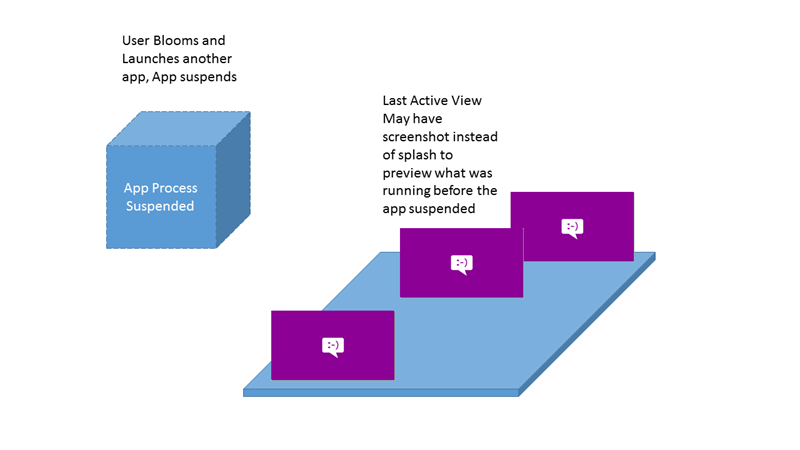

# App model

Windows Mixed Reality uses the app model provided by the [Universal Windows Platform](/windows/uwp/get-started/) (UWP), which is a model and environment for modern Windows apps. The UWP app model defines how apps are safely installed, updated, versioned, and removed completely. It also governs the application life cycle - how apps execute, sleep, and stop - and how they can preserve state. Finally, the app model covers integration and interaction with the operating system, files, and other apps.

 
*Apps with a 2D view arranged in the Windows Mixed Reality home*

## App lifecycle

The lifecycle of a mixed reality app involves standard app concepts such as placement, launch, termination, and removal.

## Placement and launch

Every app starts in mixed reality by placing an app tile (just a [Windows secondary tile](/uwp/api/Windows.UI.StartScreen.SecondaryTile)) in the [Windows Mixed Reality home](../discover/navigating-the-windows-mixed-reality-home.md). These app tiles, on placement, will start running the app. The tiles persist and stay at their placed location, acting like launchers for any time you want to get back to the app.

 
*Placement puts a secondary tile in the world*

As soon as placement completes (unless the placement was started by an [app to app](app-views.md#protocols) launch), the app starts launching. Windows Mixed Reality can run a limited number of apps at one time. 
you place and launch an app, other active apps may suspend. Suspended apps leave a screenshot of the app's last state on its app tile wherever you placed it. For more information on handling resume and other lifecycle events, see [Windows 10 UWP app lifecycle](/windows/uwp/launch-resume/app-lifecycle).

  
*Left: after placing a tile, the app starts running. Right: state diagram for app running, suspended, or not running.*

## Remove is close/terminate process

When you remove a placed app tile from the world, the underlying processes closes. This can be useful for ensuring your app is stopped or restarting a problematic app.

## App suspension/termination

In the [Windows Mixed Reality home](../discover/navigating-the-windows-mixed-reality-home.md), the user can create multiple entry points for an app by launching your app from the Start menu and placing the app tile in the world. Each app tile behaves as a different entry point, and has a separate tile instance in the system. A query for [SecondaryTile.FindAllAsync](/uwp/api/Windows.UI.StartScreen.SecondaryTile#Windows_UI_StartScreen_SecondaryTile_FindAllAsync) will result in a **SecondaryTile** for each app instance.

When a UWP app suspends, a screenshot is taken of the current state.

 
*Screenshots are shown for suspended apps*

One key difference from other Windows 10 shells is how the app is informed of an app instance activation via the [CoreApplication.Resuming](/uwp/api/Windows.ApplicationModel.Core.CoreApplication#Windows_ApplicationModel_Core_CoreApplication_Resuming) and [CoreWindow.Activated](/uwp/api/windows.ui.core.corewindow#Windows_UI_Core_CoreWindow_Activated) events.

|  Scenario |  Resuming  |  Activated | 
|----------|----------|----------|
|  Launch new instance of app from the Start menu  |   |  **Activated** with a new [TileId](/uwp/api/windows.ui.startscreen.secondarytile#Windows_UI_StartScreen_SecondaryTile_TileId) | 
|  Launch second instance of app from the Start menu  |   |  **Activated** with a new **TileId** | 
|  Select the instance of the app that isn't currently active  |   |  **Activated** with the **TileId** associated with the instance | 
|  Select a different app, then select the previously active instance  |  **Resuming** raised  |  | 
|  Select a different app, then select the instance that was previously inactive  |  **Resuming** raised  |  Then **Activated** with the **TileId** associated with the instance | 

## Extended execution

Sometimes your app needs to continue doing work in the background or playing audio. [Background tasks](/windows/uwp/launch-resume/declare-background-tasks-in-the-application-manifest) are available on HoloLens.

 
*Apps can run in the background*

## See also

* [App views](app-views.md)
* [Updating 2D UWP apps for mixed reality](../develop/porting-apps/building-2d-apps.md)
* [3D app launcher design guidance](../distribute/3d-app-launcher-design-guidance.md)
* [Implementing 3D app launchers](../distribute/implementing-3d-app-launchers.md)
