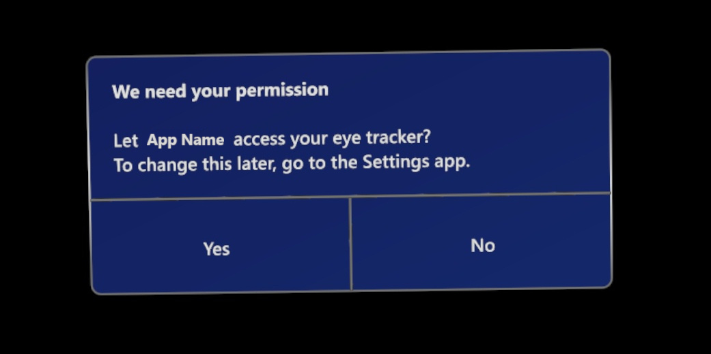
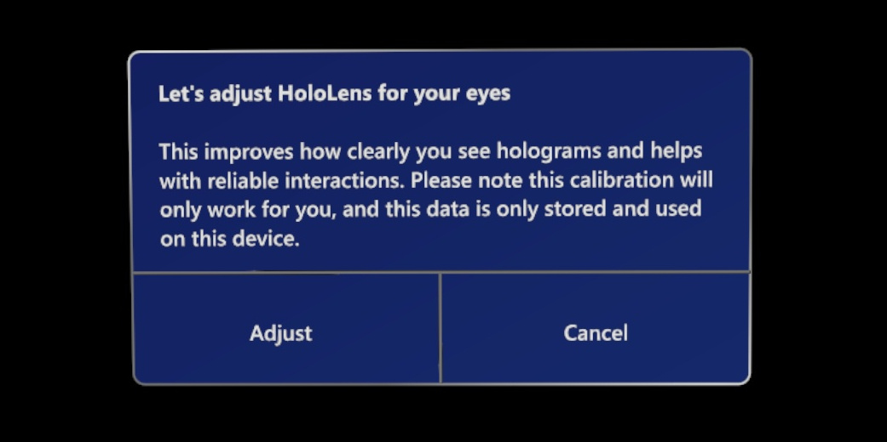
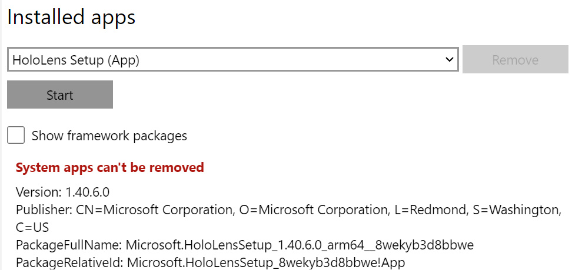

# Managing Eye Tracking Access and Calibration
Eye tracking on HoloLens 2 provides powerful capabilities for supercharging user interactions. However, there are two user checkpoints that must complete successfully in order for eye tracking to work in your app.  The two checkpoints are (a) approving eye tracking access for your app, and (b) completing eye tracking calibration on the device. The system automatically prompts to complete these as needed, but it is possible for the user to accidentally decline something and get stuck. This document outlines best practices for navigating the eye tracking checkpoints and helping the user retry when needed, ensuring a smooth and quality experience with your application.

## Access request
In order to utilize eye tracking, your app must first request access. This is done through a call to [EyesPose::RequestAccessAsync](/uwp/api/windows.perception.people.eyespose.requestaccessasync#Windows_Perception_People_EyesPose_RequestAccessAsync), which is  documented in the [eye gaze development guide](gaze-in-directx.md#requesting-access-to-eye-gaze-input). This function triggers a system check to see whether the eye gaze access is available to your application. On the first access request after install, the user will be prompted with a permissions dialog. If they click "Yes", the function will return [GazeInputAccessStatus::Allowed](/uwp/api/windows.ui.input.gazeinputaccessstatus), and you can move on with your experience. However, if the user selects "No", the function will return [GazeInputAccessStatus::DeniedByUser](/uwp/api/windows.ui.input.gazeinputaccessstatus).



The access request dialog only appears once, on your application's first launch. Once the user has made their choice, the system remembers their preference and applies it to all future access requests automatically for that signed-in user. If the user wants to change their preference later, they can do it via the 'App permissions' section of the 'Privacy' page in the HoloLens 'Settings' app.  Because the preference is sticky, the user can unfortunately get into a state where eye tracking is off and they don't know how to fix it. If eye tracking is an important part of your app experience, and you detect that eye tracking access has been denied, you can help the user by directly launching the settings app to the correct page. This is done through a call to [Launcher::LaunchUriAsync](/uwp/api/windows.system.launcher.launchuriasync) with the string "ms-settings:privacy-eyetracker".

```cpp
using namespace winrt::Windows::System::Launcher;
using namespace winrt::Windows::Foundation;

LaunchUriAsync(Uri(L"ms-settings:privacy-eyetracker"));
```

You should avoid launching the settings app automatically or prompt the user repeatedly. Instead, find a relavant location in your UI where you can communicate the current state of ET accesss, explain the the value of eye tracking for your application, and provide a button for the user to launch it themselves.

### Delaying the access request
A common reason for accidentally declining the access request is the user being spammed by multiple popups when the app first launches. A best practice here is to wait and request access only at the first moment when eye tracking will be used by your app. For example, the first time an ET-optimized menu appears. As a result, the user will have more context and less distraction while making their choice, reducing the chance that they will need to change it later.

### Considerations for OpenXR
If you are using OpenXR, the same rules apply, but the APIs that trigger the access request are a little different. OpenXR applications will automatically request permissions after the call to xrCreateSession when using an instance that has the eye tracking extension (XR_EXT_eye_gaze_interaction) enabled. To learn more about how to use eye tracking through OpenXR, visit the [eye gaze extension documentation](https://registry.khronos.org/OpenXR/specs/1.0/html/xrspec.html#XR_EXT_eye_gaze_interaction) in the OpenXR specification.

## User calibration
Once your app has access to eye tracking, the next checkpoint is user calibration. Similar to the access request, there is a specific API that can trigger a calibration UI prompt when called. The API is [SpatialPointerPose::Eyes](/uwp/api/windows.ui.input.spatial.spatialpointerpose.eyes). Note this is the same API used to retrieve eye gaze pose data on each frame, so in effect, accessing the eye tracking data triggers the calibration prompt. Because of this, applications should wait until they actually intend to use the eye tracking pose data before calling this API and possibly triggering the prompt.



HoloLens caches calibrations, and auto-swaps when it detects that a calibrated user has put the device on. So this prompt will only appear for users that have not calibrated their eye gaze on the device. If an uncalibrated user presses "Cancel" at the promt to decline calibration, their eye gaze will not be available to any applications on the device. HoloLens remembers their selection and will not prompt again until the device is removed and put back on. While important for privacy purposes, this can create confusion for users if they accidentally cancel the prompt are then not able to use eye tracking in your application.

To check whether the current user is calibrated, call [EyesPose::IsCalibrationValid](/uwp/api/windows.perception.people.eyespose.iscalibrationvalid#Windows_Perception_People_EyesPose_IsCalibrationValid). If the current user is not calibrated, you should ideally fall back to interactions that are not dependent on eye gaze. However, if eye gaze is critical for your experience and you need to ensure that all of your users are calibrated, you can manually invoke the calibration app using [Launcher::LaunchUriForResultsAsync](/uwp/api/windows.system.launcher.launchuriforresultsasync) with the string "ms-hololenssetup://EyeTracking".

```cpp
using namespace winrt::Windows::System::Launcher;
using namespace winrt::Windows::Foundation;

winrt::Windows::System::LauncherOptions options;
auto package = winrt::Windows::ApplicationModel::Package::Current();
options.TargetApplicationPackageFamilyName(L"Microsoft.HoloLensSetup_8wekyb3d8bbwe");
winrt::Windows::System::Launcher::LaunchUriForResultsAsync(winrt::Windows::Foundation::Uri(L"ms-hololenssetup://EyeTracking"), options);
```

LaunchUriForResultsAsync is a sibling of the more well-known LaunchUriAsync API, which has already been [suggested](https://stackoverflow.com/questions/56877610/can-i-trigger-the-hololens-calibration-sequence-from-inside-my-application/57051643#57051643) as a method for launching the calibration app. However, the LaunchUriAsync method *does not* guarantee a return back to your application after calibration is complete. In most cases, it will simply return to the shell. The LaunchUriForResultsAsync API *does* guarantee a return back to your application, and is therefore a much better experience for the user.

LaunchUriForResultsAsync requires an additional 'options' parameter with the 'TargetApplicationPackageFamilyName' property set to match the HoloLens Setup application. If you are ever in need of the package family name string for an application installed on your HoloLens, you can find it in the 'Apps : Installed apps" section of Windows Device Portal under 'PackageRelativeId'. Just remove the "!App" characters from the end of the string.



Apps should never launch eye gaze calibration automatically and without user interaction. Similar to the access request, we recommend you find a relavant location in your UI where you can show the calibration status, communicate the value of eye tracking for your application, and provide a button for the user to launch calibration themselves.

## Considerations for OpenXR
If you are using OpenXR, the same patterns apply, but the API that triggers the calibration prompt is a little different. In OpenXR, the prompt will trigger for uncalibrated users on the first call to xrSyncActions with an eye gaze action enabled. To learn more about how to use eye tracking through OpenXR, visit the [eye gaze extension documentation](https://registry.khronos.org/OpenXR/specs/1.0/html/xrspec.html#XR_EXT_eye_gaze_interaction) in the OpenXR specification.