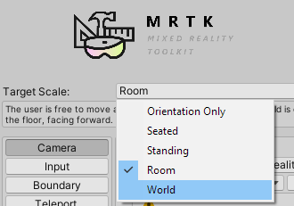

# [MRTK](#tab/mrtk)
<!-- NEVER CHANGE THE ABOVE LINE! -->

Use the [MixedRealityPlayspace](/dotnet/api/microsoft.mixedreality.toolkit.mixedrealityplayspace) class from MRTK for Unity and set the **Target Scale** to either **Room** or **Standing**:



MRTK should handle the position of the playspace and camera automatically, but it's good to double check:


1. From the **Hierarchy** panel, expand the **MixedRealityPlayspace** GameObject and find the **Main Camera** child object
2. In the **Inspector** panel, find the **Transform** component and change the **Position** to **(X: 0, Y: 0, Z: 0)**

# [XR SDK](#tab/xr)
<!-- NEVER CHANGE THE ABOVE LINE! -->

Set your tracking origin mode on the [XRInputSubsystem](https://docs.unity3d.com/Documentation/ScriptReference/XR.XRInputSubsystem.html). After obtaining the subsystem, call [TrySetTrackingOriginMode](https://docs.unity3d.com/Documentation/ScriptReference/XR.XRInputSubsystem.TrySetTrackingOriginMode.html):

```cs
xrInputSubsystem.TrySetTrackingOriginMode(TrackingOriginModeFlags.Floor);
```

And work with Unity's [XRRig](https://docs.unity3d.com/Manual/configuring-project-for-xr.html).


# [Legacy WSA](#tab/wsa)
<!-- NEVER CHANGE THE ABOVE LINE! -->

1. Go to **Other Settings** section of the **Windows Store Player Settings**
2. Choose **Windows Mixed Reality** as the device, which may be listed as **Windows Holographic** in older versions of Unity
3. Select **Virtual Reality Supported**

Since the Main Camera object is automatically tagged as the camera, Unity powers all movement and translation.

>[!NOTE]
>These settings need to be applied to the Camera in each scene of your app.
>
>By default, when you create a new scene in Unity, it will contain a Main Camera GameObject in the Hierarchy which includes the Camera component, but does not have the settings below properly applied.

**Namespace:** *UnityEngine.XR*<br>
**Type:** *XRDevice*

For a **standing-scale** or **room-scale experience**, you'll need to place content relative to the floor. You reason about the user's floor using the **[spatial stage](../../../../design/coordinate-systems.md#spatial-coordinate-systems)**, which represents the user's defined floor-level origin and optional room boundary, set up during first run.

To ensure that Unity is operating with its world coordinate system at floor-level, you can set and test that Unity is using the RoomScale tracking space type:

```cs
if (XRDevice.SetTrackingSpaceType(TrackingSpaceType.RoomScale))
{
    // RoomScale mode was set successfully.  App can now assume that y=0 in Unity world coordinate represents the floor.
}
else
{
    // RoomScale mode was not set successfully.  App cannot make assumptions about where the floor plane is.
}
```

* If SetTrackingSpaceType returns true, Unity has successfully switched its world coordinate system to track the [stage frame of reference](../../../../design/coordinate-systems.md#spatial-coordinate-systems).
* If SetTrackingSpaceType returns false, Unity was unable to switch to the stage frame of reference, likely because the user has not set up a floor in their environment. While a false return value isn't common, it can happen if the stage is set up in a different room and the device is moved to the current room without the user setting up a new stage.

Once your app successfully sets the RoomScale tracking space type, content placed on the y=0 plane will appear on the floor. The origin at 0, 0, 0 will be the specific place on the floor where the user stood during room setup, with -Z representing the forward direction they were facing during setup.