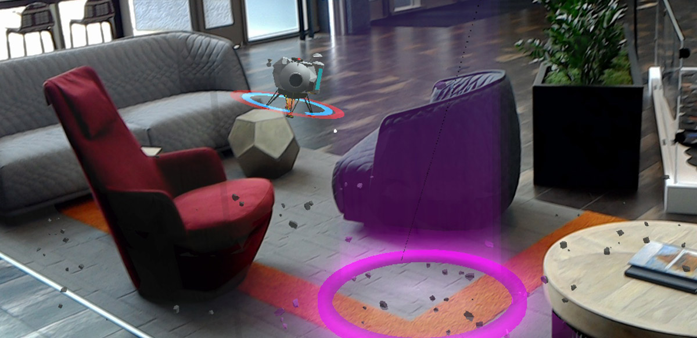
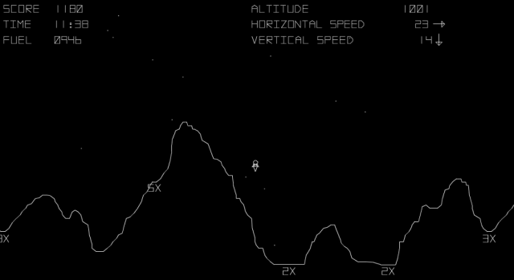
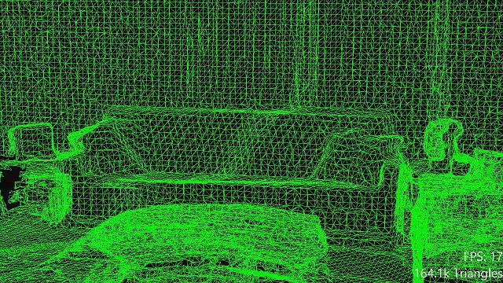
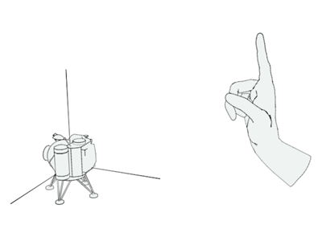
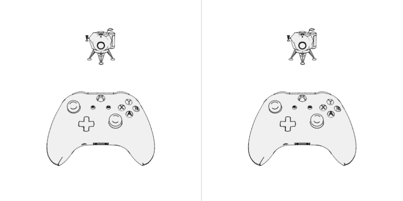

# Lunar Module

>[!NOTE]
>This article discusses an exploratory sample we’ve created in the [Mixed Reality Design Labs](https://github.com/Microsoft/MRDesignLabs_Unity), a place where we share our learnings about and suggestions for mixed reality app development. Our design-related articles and code will evolve as we make new discoveries.

>[!NOTE]
>This sample app was designed for HoloLens 1st gen.

[Lunar Module](https://github.com/Microsoft/MRDesignLabs_Unity_LunarModule) is an open-source sample app from Microsoft's Mixed Reality Design Labs. Learn how to extend HoloLens' base gestures with two-handed tracking and Xbox controller input, create objects that are reactive to surface mapping and plane finding, and implement simple menu systems. All of the project's components are available for use in your own mixed reality app experiences.

## Demo video 
> [!VIDEO https://www.microsoft.com/en-us/videoplayer/embed/RE4IcIP]

Recorded with HoloLens 2 using Mixed Reality Capture

## Rethinking classic experiences for Windows Mixed Reality

High up in the atmosphere, a small ship reminiscent of the Apollo module methodically surveys jagged terrain below. Our fearless pilot spots a suitable landing area. The descent is arduous but thankfully, this journey has been made many times before...

 
*Original interface from Atari’s 1979 Lunar Lander*

[Lunar Lander](https://en.wikipedia.org/wiki/Lunar_Lander_(1979_video_game)) is an arcade classic where players attempt to pilot a moon lander onto a flat spot of lunar terrain. Anyone born in the 1970s has most likely spent hours in an arcade with their eyes glued to this vector ship plummeting from the sky. As a player navigates their ship toward a landing area, the terrain scales to reveal progressively more detail. Success means landing within the safe threshold of horizontal and vertical speed. Points are awarded for time spent landing and remaining fuel, with a multiplier based on the size of the landing area.

Aside from the gameplay, the arcade era of games brought constant innovation of control schemes. From the simplest four-way joystick and button configurations (seen in the iconic [Pac-Man](https://en.wikipedia.org/wiki/Pac-Man)) to the highly specific and complicated schemes seen in the late 90 s and 00s (like those in golf simulators and rail shooters). The input scheme used in the Lunar Lander machine is intriguing for two reasons: curb appeal and immersion.

 
*Atari's Lunar Lander arcade console*

Why did Atari and so many other game companies decide to rethink input?

A kid walking through an arcade will naturally be intrigued by the newest, flashiest machine. But Lunar Lander features a novel input mechanic that stood out from the crowd.

Lunar Lander uses two buttons for rotating the ship left and right and a **thrust lever** to control the amount of thrust the ship produces. This lever gives users a certain level of finesse a regular joystick can’t provide. It also happens to be a component common to modern aviation cockpits. Atari wanted Lunar Lander to immerse the user in the feeling that they were in fact piloting a lunar module. This concept is known as **tactile immersion**.

Tactile immersion is the experience of sensory feedback from doing repetitive actions. In this case, the repetitive action of adjusting the throttle lever and rotation, which our eyes see and our ears hear, helps connect the player to the act of landing a ship on the moon’s surface. This concept can be tied to the psychological concept of "flow." Where a user is fully absorbed in a task that has the right mixture of challenge and reward, or put more simply, they’re “in the zone.”

Arguably, the most prominent type of immersion in mixed reality is spatial immersion. The whole point of mixed reality is to fool ourselves into believing these digital objects exist in the real world. We’re synthesizing holograms in our surroundings, spatially immersed in entire environments and experiences. This doesn’t mean we can’t still employ other types of immersion in our experiences just as Atari did with tactile immersion in Lunar Lander.

## Designing with immersion

How might we apply tactile immersion to an updated, volumetric sequel to the Atari classic? Before tackling the input scheme, the game construct for three-dimensional space needs to be addressed.

 
*Visualizing spatial mapping in HoloLens*

By leveraging a user’s surroundings, we effectively have infinite terrain options for landing our lunar module. To make the game most like the original title, a user could potentially manipulate and place landing pads of varying difficulties in their environment.

Requiring the user to learn the input scheme, control the ship, and have a small target to land on is a lot to ask. A successful game experience features the right mix of challenge and reward. The user can choose a level of difficulty, with the easiest mode simply requiring the user to successfully land in a user-defined area on a surface scanned by the HoloLens. Once a user gets the hang of the game, they can then crank up the difficulty as they see fit.

### Adding input for hand gestures

HoloLens base input has only two gestures - [Air Tap and Bloom](../../design/gaze-and-commit.md#composite-gestures). Users don’t need to remember contextual nuances or a laundry list of specific gestures that makes the platform’s interface both versatile and easy to learn. While the system may only expose these two gestures, HoloLens as a device is can track two hands at once. Our ode to Lunar Lander is an [immersive app, which means we can extend the base set of gestures to leverage two hands and add our own delightfully tactile means for lunar module navigation.

Looking back at the original control scheme, **we needed to solve for thrust and rotation**. The caveat is rotation in the new context adds an additional axis (technically two, but the Y axis is less important for landing). The two distinct ship movements naturally lend themselves to be mapped to each hand:

 
*Tap and drag gesture to rotate lander on all three axes*

**Thrust**

The lever on the original arcade machine mapped to a scale of values, the higher the lever was moved the more thrust was applied to the ship. An important nuance to point out here is how the user can take their hand off of the control and maintain a desired value. We can effectively use tap-and-drag behavior to achieve the same result. The thrust value starts at zero. The user taps and drags to increase the value. At that point they could let go to maintain it. Any tap-and-drag gesture value change would be the delta from the original value.

**Rotation**

This is a little more tricky. Having holographic “rotate” buttons to tap makes for a terrible experience. There isn’t a physical control to leverage, so the behavior must come from manipulation of an object representing the lander, or with the lander itself. We came up with a method using tap-and-drag, which enables a user to effectively “push and pull” it in the direction they want it to face. Anytime a user taps and holds, the point in space where the gesture was initiated becomes the origin for rotation. Dragging from the origin converts the delta of the hand's translation (X,Y,Z) and applies it to the delta of the lander's rotation values. Or more simply, *dragging left <-> right, up <-> down, forward <-> back in spaces rotates the ship accordingly*.

Since the HoloLens can track two hands, rotation can be assigned to the right hand while thrust is controlled by the left. Finesse is the driving factor for success in this game. The *feel* of these interactions is the absolute highest priority. Especially in context of tactile immersion. A ship that reacts too quickly would be difficult to steer, while one too slow would require the user to “push and pull” on the ship for an awkwardly long amount of time.

### Adding input for game controllers

While hand gestures on the HoloLens provide a novel method of fine-grain control, There's still a certain lack of 'true' tactile feedback that you get from analog controls. Connecting an Xbox game controller allows us to bring back this sense of physicality while leveraging the control sticks to keep fine-grain control.

There are multiple ways to apply the relatively straight-forward control scheme to the Xbox controller. Since we're trying to stay as close to the original arcade set up as possible, **Thrust** maps best to the trigger button. These buttons are analog controls, meaning they have more than simple *on and off* states, they actually respond to the degree of pressure put on them. This gives us a similar construct as the **thrust lever**. Unlike the original game and the hand gesture, this control will cut the ship's thrust once a user stops putting pressure on the trigger. It still gives the user the same degree of finesse as the original arcade game did.

 
*Left thumbstick is mapped to yaw and roll; right thumbstick is mapped to pitch and roll*

The dual thumbsticks naturally lend themselves to controlling ship rotation. Unfortunately, there are three axes on which the ship can rotate and two thumbsticks which both support two axes. This mismatch means either one thumbstick controls one axis; or there's overlap of axes for the thumbsticks. The former solution ended up feeling "broken" since thumbsticks inherently blend their local X and Y values. The latter solution required some testing to find which redundant axes feel the most natural. The final sample uses *yaw* and *roll* (Y and X axes) for the left thumbstick, and *pitch* and *roll* (Z and X axes) for the right thumbstick. This felt the most natural as *roll* seems to independently pair well with *yaw* and *pitch*. As a side note, using both thumbsticks for *roll* also happens to double the rotation value; it's pretty fun to have the lander do loops.

This sample app demonstrates how spatial recognition and tactile immersion can significantly change an experience thanks to Windows Mixed Reality's extensible input modalities. While Lunar Lander may be nearing 40 years in age, the concepts exposed with that little octagon-with-legs will live on forever. When imagining the future, why not look at the past?

## Technical details

You can find scripts and prefabs for the Lunar Module sample app on the [Mixed Reality Design Labs GitHub](https://github.com/Microsoft/MRDesignLabs_Unity_LunarModule).

## About the author

<table>
<tr>
<td width="60"></td>
<td><b>Addison Linville</b> UX Designer @Microsoft</td>
</tr>
</table>

## See also

* [MRTK Examples Hub](/windows/mixed-reality/mrtk-unity/features/example-scenes/example-hub) - [(Download from Microsoft Store in HoloLens 2)](https://www.microsoft.com/en-us/p/mrtk-examples-hub/9mv8c39l2sj4)
* [Surfaces](sampleapp-surfaces.md) - [(Download from Microsoft Store in HoloLens 2)](https://www.microsoft.com/en-us/p/surfaces/9nvkpv3sk3x0)
* [Periodic Table of the Elements 2.0](periodic-table-of-the-elements-2.md)
* [Galaxy Explorer 2.0](galaxy-explorer-update.md)