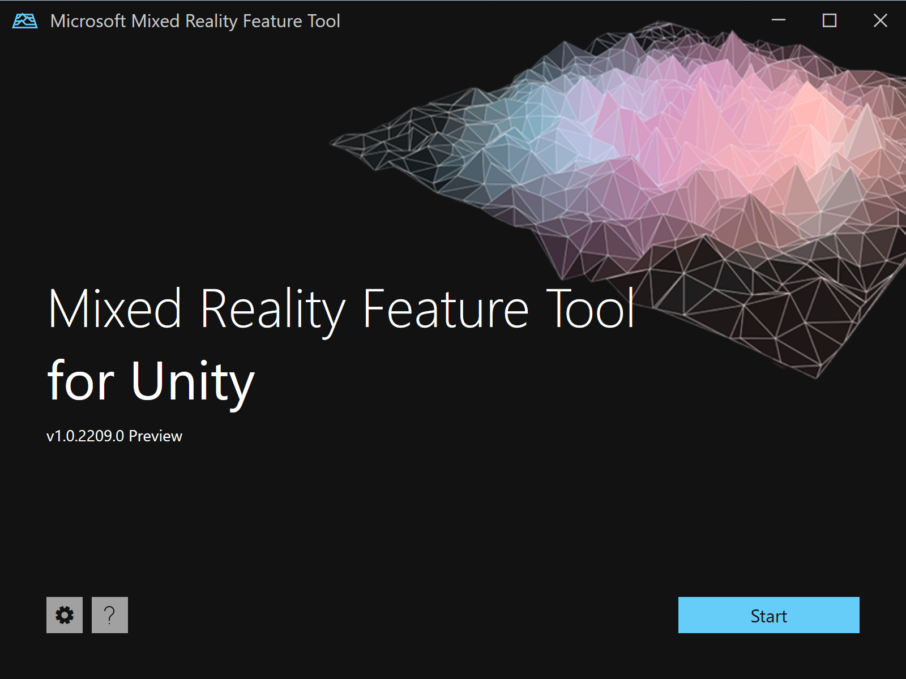
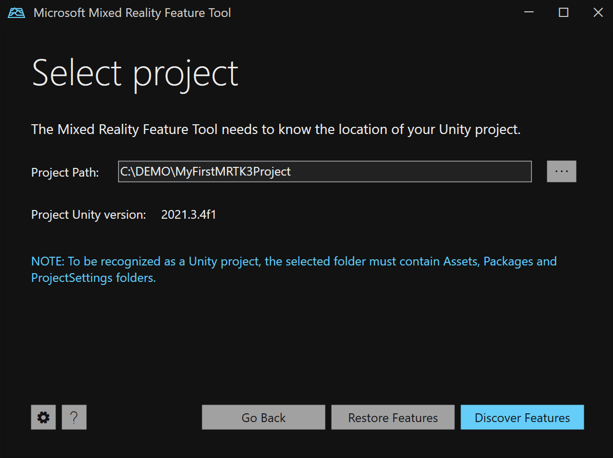
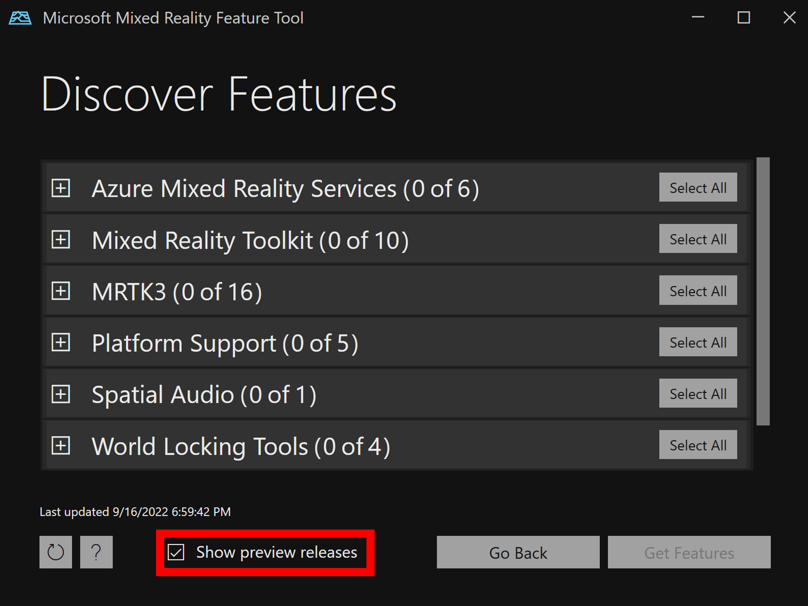
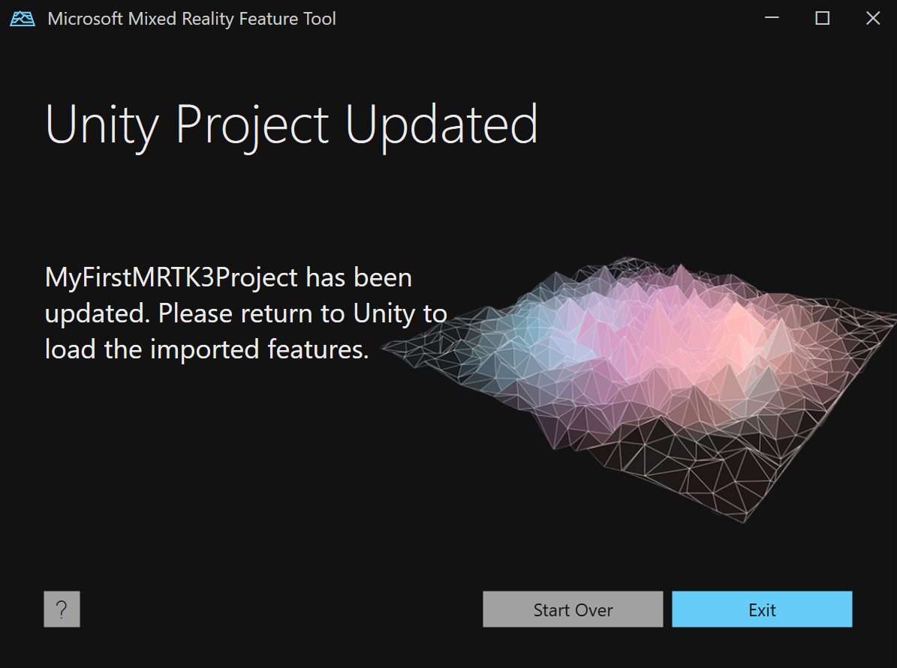

# Welcome to the Mixed Reality Feature Tool

> [!IMPORTANT]
> The Mixed Reality Feature Tool is only available for Unity at the moment. If you're developing in Unreal, refer to the [tools installation](../install-the-tools.md) documentation.

The Mixed Reality Feature Tool is a new way for developers to discover, update, and add Mixed Reality feature packages into Unity projects. You can search packages by name or category, see their dependencies, and even view proposed changes to your projects manifest file before importing. If you've never worked with a manifest file before, it's a JSON file containing all your projects packages. Once you've validated the packages you want, the Mixed Reality Feature tool will download them into the project of your choice.

## System requirements

Before you can run the Mixed Reality Feature Tool, you'll need:

* A PC running Windows 10 or 11 with an active Internet connection

> [!NOTE]
> If the PC is on a network managed by an organization, make sure access to the following URLs is allowed:
> * https://aka.ms/*
> * https://learn.microsoft.com/*
> * https://pkgs.dev.azure.com/*
> * https://feeds.dev.azure.com/*
> * https://mixedrealitycloud.pkgs.visualstudio.com/* (for special early access users only)

## Download

Once you have your environment set up:

* [Download the latest version of the Mixed Reality Feature Tool](https://aka.ms/MRFeatureTool) from the Microsoft Download Center.
* When the download completes, unzip the file and save it to your desktop
    * We recommend creating a shortcut to the executable file for faster access

> [!NOTE]
> If you're new to using the Unity Package Manager, follow our [UPM instructions](/windows/mixed-reality/mrtk-unity/configuration/usingupm#managing-mixed-reality-features-with-the-unity-package-manager).

## Changes in this release

Version 1.0.2209.0-Preview includes the following improvements:

* Added 'show preview features' option to the discover features view
* Updated to .NET 6
* Consolidated the app and .NET 6 runtime into a single executable for easier distribution
* Fixed an issue where a prompt for downgrading existing package versions shows up when unnecessary

## 1. Getting started

Launch the Mixed Reality Feature Tool from the executable file, which displays the start page on first launch:

From the start page, you can:

* [Configure](configuring-feature-tool.md) tool settings using the **gear icon** button
* Use the **question mark** button to launch the default web browser and display our documentation
* Select **Start** to begin discovering feature packages

## 2. Selecting your Unity project

To ensure that all discovered features are supported on your project's version of Unity, the fist step is to point the Mixed Reality Feature Tool to your project using the **ellipsis** button (to the right of the project path field).

> [!NOTE]
> The dialog that's displayed when browsing for the Unity project folder contains '_' as the file name. There must be a value for the file name to enable the folder to be selected.

When you have located your project's folder, click the Open button to return to the Mixed Reality Feature Tool.

> [!IMPORTANT]
> The Mixed Reality Feature Tool performs validation to ensure that it has been directed to a Unity project folder. The folder must contain `Assets`, `Packages` and `Project Settings` folders.

Once the project has been selected, you can

- **Restore Features**: download the Feature Tool shipped packages listed in the project manifest to **Packages/MixedReality** if they are not present there already. The feature is similar to `nuget restore` in concept. Typically you only need to perform this operation if you have a project (with Feature Tool packages) cloned from a repo configured to ignore tarball files. You can close the Feature Tool after restoring if you do not need to get new packages.

**and/or**

- **Discover Features**: proceed to the next page to select the packages you want to add to your project.

## 3. Discovering and acquiring feature packages

Features are grouped by category to make things easier to find. For example, the **Mixed Reality Toolkit** category has several features for you to choose from:

> [!NOTE]
> If you will be using the MRTK3 public preview release in your project, you must enable `Show preview releases` as shown below in the red box.
>
> 

When the Mixed Reality Feature Tool recognizes previously imported feature(s), it displays a notification message by each.

Once you've made your choices, select **Get features** to download all the required packages from the catalog. For more information, please see [discovering and acquiring features](discovering-features.md).

## 4. Importing feature packages

Following acquisition, the complete set of packages is presented, along with a list of required dependencies. If you need to change any feature or package selections, this is the time:

We highly recommend using the **Validate** button to ensure the Unity project can successfully import the selected features. After validation, you'll see a pop-up dialog with a success message or a list of identified issues.

Select **Import** to continue.

> [!NOTE]
> After clicking the **Import** button, if any issues remain a simple message will be displayed. The recommendation is to click No and to use the **Validate** button to view and resolve the issues.

For more information, please see [importing features](importing-features.md).

## 5. Reviewing and approving project changes

The final step is reviewing and approving the proposed changes to the manifest and project files:

* The proposed changes to the manifest are displayed on the left
* The files to be added to the project are listed to the right
* The **Compare** button allows for side by side viewing of the current manifest and the proposed changes

For more information, see [reviewing and approving project modifications](reviewing-changes.md).

## 6. Project updated

When the proposed changes are approved, your target Unity project is updated to reference the selected Mixed Reality features.

The Unity project's **Packages** folder now has a **MixedReality** subfolder with the feature package file(s) and the manifest will contain the appropriate reference(s).

Return to Unity, wait for the new selected features to load, and start building!

## See also

- [Configuring the feature tool](configuring-feature-tool.md)
- [Discovery and acquisition](discovering-features.md)
- [Viewing feature package details](viewing-package-details.md)
- [Importing selected packages](importing-features.md)
- [Reviewing and approving project modifications](reviewing-changes.md)