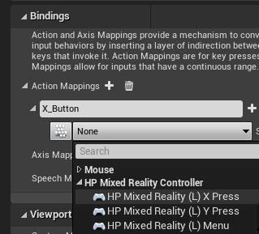
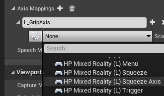
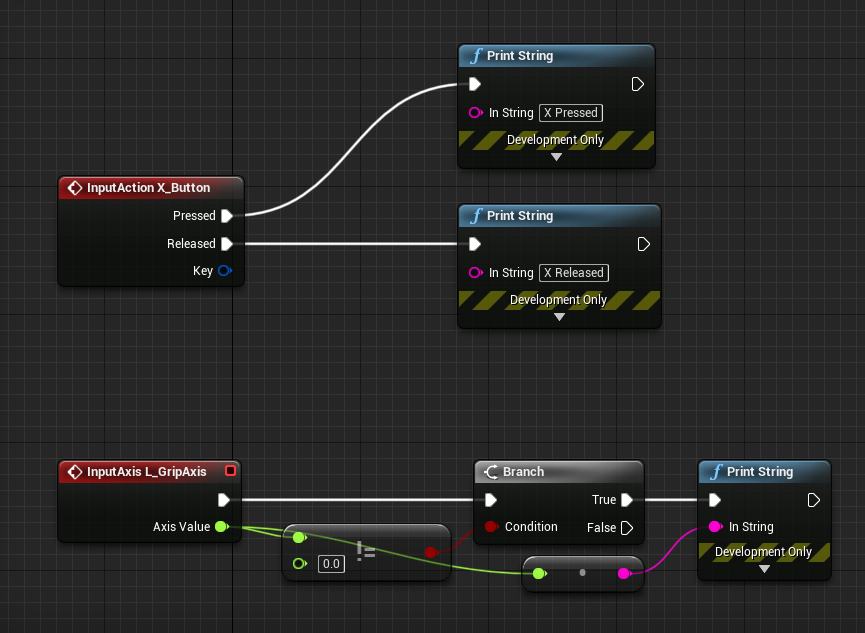

# HP Reverb G2 Controllers in Unreal 

## Getting started

> [!IMPORTANT]
> Unreal Engine 4.26 and either OpenXR or SteamVR is required to access the HP Motion Controller plugin you'll need to work with the HP Reverb G2 controllers.

[!INCLUDE]

## Porting an existing OpenXR app 

If no controller bindings exist in the game for the HP Mixed Reality Controller, the OpenXR runtime will try to remap existing bindings to the active controller.  In this case, the game has Oculus Touch bindings and no HP Mixed Reality Controller bindings.

The events will still fire, but if the game needs to make use of controller-specific bindings, like the right menu button, the HP Mixed Reality interaction profile must be used.  Multiple controller bindings can be specified per action to better support different devices.
   

## Adding input action mappings 

Define a new action and map to one of the key presses in the HP Mixed Reality Controller section.

The HP Reverb G2 controller also has an analog grip, which can be used in the axis mappings with the “Squeeze Axis” binding.  There's a separate Squeeze binding, which should be used for action mappings when the grip button is fully pressed. 

## Adding input events

Right-click on a Blueprint and search for the new action names from the input system to add events for these actions.  Here the Blueprint is responding to the events with a print string outputting the current button and axis state.

### Using input 

[!INCLUDE]

## See also
* [SteamVR Input](https://docs.unrealengine.com/Platforms/VR/SteamVR/HowTo/SteamVRInput/index.html)
* [Using SteamVR with Windows Mixed Reality](/windows/mixed-reality/enthusiast-guide/using-steamvr-with-windows-mixed-reality)
* [Unreal Player Camera](https://docs.unrealengine.com/quick-start-guide-to-player-controlled-cameras-in-unreal-engine-cpp/)