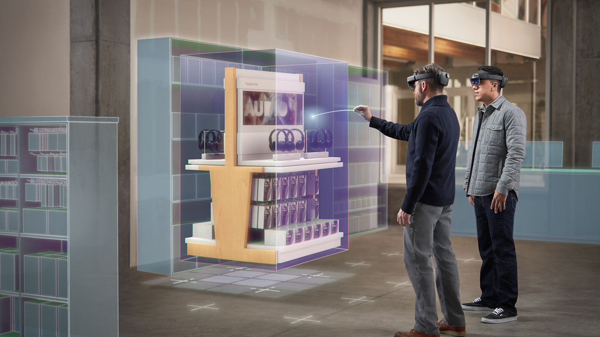
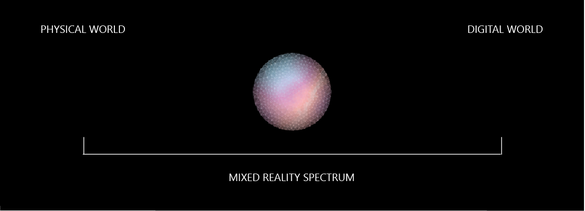
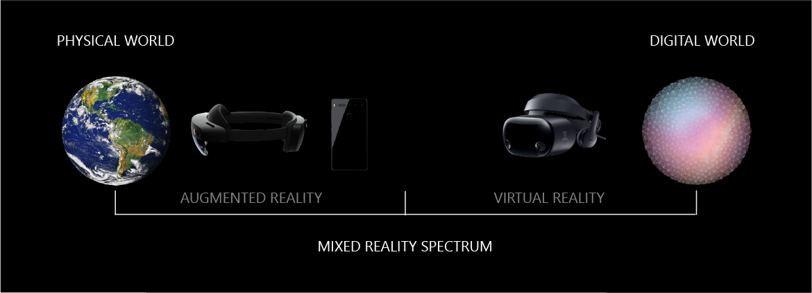

# What is mixed reality?

Mixed reality is the next wave in computing following mainframes, PCs, and smartphones. Mixed reality is going mainstream for consumers and businesses.  It liberates us from screen-bound experiences by offering instinctual interactions with data in our living spaces and with our friends.  Online explorers, in hundreds of millions around the world, have experienced mixed reality through their handheld devices.  Mobile AR offers the most mainstream mixed reality solutions today on social media. People may not even realize that the AR filters they use on Instagram are mixed reality experiences. Windows Mixed Reality takes all these user experiences to the next level with stunning holographic representations of people, high fidelity holographic 3D models, and the real world around them.

Mixed reality is a blend of physical and digital worlds, unlocking natural and intuitive 3D human, computer, and environmental interactions. This new reality is based on advancements in computer vision, graphical processing, display technologies, input systems, and cloud computing. The term "mixed reality" was introduced in a 1994 paper by Paul Milgram and Fumio Kishino, "[A Taxonomy of Mixed reality Visual Displays](https://search.ieice.org/bin/summary.php?id=e77-d_12_1321)." Their paper explored the concept of a *virtuality continuum* and the taxonomy of visual displays. Since then, the application of mixed reality has gone beyond displays to include:

* Environmental understanding: spatial mapping and anchors.
* Human understanding: hand-tracking, eye-tracking, and speech input.
* Spatial sound.
* Locations and positioning in both physical and virtual spaces.
* Collaboration on 3D assets in mixed reality spaces.

 
*Image: mixed reality is the result of blending the physical world with the digital world.*

 

---

## Environmental input and perception

In recent decades, the relationship between humans and computers has continued to evolve by means of input methods. A new discipline has emerged that's known as human-computer interaction or "HCI". Human input can now include keyboards, mice, touch, ink, voice, and [Kinect](/azure/kinect-dk/about-azure-kinect-dk) skeletal tracking.

Advancements in sensors and processing power are creating new computer perceptions of environments based on advanced input methods. This is why API names in Windows that reveal environmental information are called the [perception APIs](/uwp/api/Windows.Perception). Environmental inputs can capture: 

* a person's body position in the physical world ([head tracking](../design/coordinate-systems.md)) 
* objects, surfaces, and boundaries ([spatial mapping](../design/spatial-mapping.md) and [scene understanding](../design/scene-understanding.md)) 
* ambient lighting and sound
* object recognition
* physical locations

 

  
*Image: The interactions between computers, humans, and environments.*

 

A combination of three essential elements sets the stage for creating true mixed reality experiences:

* Computer processing powered by the cloud
* Advanced input methods
* Environmental perceptions

As we move through the physical world, our movements are mapped in a digital reality. Physical boundaries influence mixed reality experiences such as games or task-based guidance in a manufacturing facility. With environmental input and perceptions, experiences start to blend between physical and digital realities.

 

---

## The mixed reality spectrum

Mixed reality blends both physical and digital worlds.  These two realities mark the polar ends of a spectrum known as the *virtuality continuum*. We refer to this spectrum of realities as the *mixed reality spectrum*.  On one end of the spectrum, we have the physical reality that we as humans exist. On the other end of the spectrum, we have the corresponding digital reality.

 

> [!VIDEO https://www.youtube.com/embed/_xpI0JosYUk]

 

### Augmented vs. virtual reality

Most mobile phones on the market today have little to no environmental perception capabilities. The experiences these phones offer can't mix physical and digital realities. 

The experiences that overlay graphics, video streams, or holograms in the physical world are called augmented reality. The experiences that occlude your view to present a fully immersive digital experience are virtual reality. The experiences that can transition between augmented and virtual realities form mixed reality, where you can:

* Place a digital object, such as a hologram, in the physical world as if it were physically present.
* Be personally and digitally present in the physical world, in the form of an avatar, to asynchronously collaborate with others at different points in time.

When a user is in virtual reality, the physical obstacles in their immediate surroundings, such as walls and furniture, are represented digitally within the experience so that the user can avoid colliding with those physical obstacles.

 

 
*Image: The mixed reality spectrum*

 

Most augmented reality and virtual reality experiences available today represent a small subset of the larger mixed reality spectrum. Windows 10 is built with the entire spectrum in mind, and allows blending digital representations of people, places, and things with the real world.

## Devices and experiences

There are two main types of devices that deliver Windows Mixed Reality experiences:
1. **Holographic devices** are characterized by the device's ability to display digital objects as if they existed in the real world.
2. **Immersive VR devices** are characterized by the device's ability to create a sense of presence by blocking out the physical world and replacing it with a fully immersive digital experience.

<table>
<tr>
<th width="30%"> Characteristic</th><th width="35%"> Holographic devices</th><th width="35%"> Immersive devices</th>
</tr><tr>
<td><strong>Example device</strong></td><td> Microsoft HoloLens   </td><td> Samsung HMD Odyssey+   </td>
</tr><tr>
<td><strong>Display</strong></td><td> See-through display. Allows the user to see the physical environment while wearing the headset.</td><td> Opaque display. Blocks out the physical environment while wearing the headset.</td>
</tr><tr>
<td><strong>Movement</strong></td><td> Full six-degrees-of-freedom movement, both rotation and translation.</td><td> Full six-degrees-of-freedom movement, both rotation and translation.</td>
</tr>
</table> 

> [!NOTE]
> Whether a device is tethered to a separate PC (via USB cable or Wi-Fi) or untethered doesn't reflect whether a device is holographic or immersive. Features that improve mobility often provide better experiences. Holographic and immersive devices can be either tethered or untethered.

Mixed reality experiences are the result of technological advancements. Windows 10 provides a common mixed reality platform for both device manufacturers and developers. Any given device today can support a specific range within the mixed reality spectrum. In the future, new devices with more expansive range are expected: holographic devices will be more immersive, and immersive devices will be more holographic.

 

 
*Image: Where devices exist on the mixed reality spectrum*

As an application or game developer, what type of experiences do you want to create? The experiences will typically target a specific point or part on the spectrum. You'll need to consider the capabilities of devices you wish to target. Experiences that rely on the physical world will run best on HoloLens.

* **Towards the left (near physical reality).** Users remain present in their physical reality, and aren't made to believe they have left that reality.
* **In the middle (fully mixed reality).** These experiences blend the real world and the digital world. For example, in the movie [Jumanji](https://en.wikipedia.org/wiki/Jumanji), the physical structure of the house where the story took place was blended with a jungle environment.
* **Towards the right (near digital reality).** Users experience a digital reality and are unaware of the physical reality around them.

## Next Discovery Checkpoint

You're in the beginning of the [discovery journey](get-started-with-mr.md) we've laid out for you, and exploring the basics of mixed reality. From here, you can continue to the next foundational topic: 

> [!div class="nextstepaction"]
> [What is a hologram?](hologram.md)
