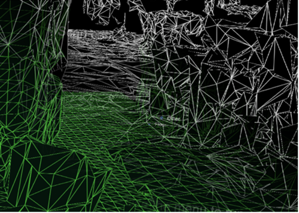
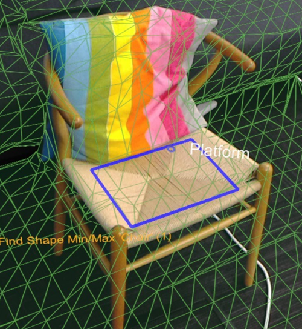
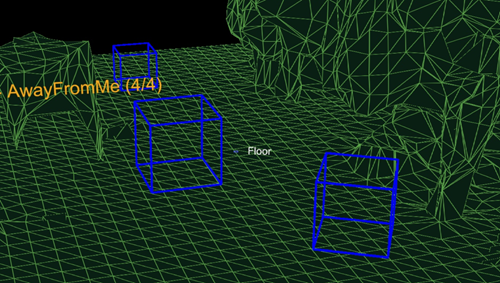
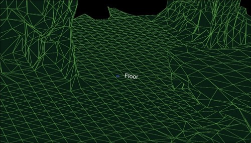

# Case study - Expanding the spatial mapping capabilities of HoloLens

When creating our first apps for Microsoft HoloLens, we were eager to see just how far we could push the boundaries of spatial mapping on the device. Jeff Evertt, a software engineer at Microsoft Studios, explains how a new technology was developed out of the need for more control over how holograms are placed in a user's real-world environment.

> [!NOTE]
> HoloLens 2 implements a new [Scene Understanding Runtime](../design/scene-understanding.md), that provides Mixed Reality developers with a structured, high-level environment representation designed to make developing for environmentally aware applications intuitive. 

## Watch the video

>[!VIDEO https://www.youtube.com/embed/iUmTi3_Ynus]

## Beyond spatial mapping

While we were working on [Fragments](https://www.microsoft.com/p/fragments/9nblggh5ggm8) and [Young Conker](https://www.microsoft.com/p/young-conker/9nblggh5ggk1), two of the first games for HoloLens, we found that when we were doing procedural placement of holograms in the physical world, we needed a higher level of understanding about the user's environment. Each game had its own specific placement needs: In Fragments, for example, we wanted to be able to distinguish between different surfaces—such as the floor or a table—to place clues in relevant locations. We also wanted to be able to identify surfaces that life-size holographic characters could sit on, such as a couch or a chair. In Young Conker, we wanted Conker and his opponents to be able to use raised surfaces in a player's room as platforms.

[Asobo Studios](https://www.asobostudio.com/index.html), our development partner for these games, faced this problem head-on and created a technology that extends the spatial mapping capabilities of HoloLens. Using this, we could analyze a player's room and identify surfaces such as walls, tables, chairs, and floors. It also gave us the ability to optimize against a set of constraints to determine the best placement for holographic objects.

## The spatial understanding code

We took Asobo's original code and created a library that encapsulates this technology. Microsoft and Asobo have now open-sourced this code and made it available on [MixedRealityToolkit](https://github.com/Microsoft/MixedRealityToolkit-Unity/tree/htk_release/Assets/HoloToolkit/SpatialMapping) for you to use in your own projects. All the source code is included, allowing you to customize it to your needs and share your improvements with the community. The code for the C++ solver has been wrapped into a UWP DLL and exposed to Unity with a [drop-in prefab contained within MixedRealityToolkit](https://github.com/Microsoft/MixedRealityToolkit-Unity/tree/htk_release/Assets/HoloToolkit-Examples/SpatialUnderstanding).

There are many useful queries included in the Unity sample that will allow you to find empty spaces on walls, place objects on the ceiling or on large spaces on the floor, identify places for characters to sit, and a myriad of other spatial understanding queries.

While the spatial mapping solution provided by HoloLens is designed to be generic enough to meet the needs of the entire gamut of problem spaces, the spatial understanding module was built to support the needs of two specific games. As such, its solution is structured around a specific process and set of assumptions:
* **Fixed size playspace**: The user specifies the maximum playspace size in the init call.
* **One-time scan process**: The process requires a discrete scanning phase where the user walks around, defining the playspace. Query functions will not function until after the scan has been finalized.
* **User driven playspace “painting”**: During the scanning phase, the user moves and looks around the playspace, effectively painting the areas which should be included. The generated mesh is important to provide user feedback during this phase.
* **Indoors home or office setup**: The query functions are designed around flat surfaces and walls at right angles. This is a soft limitation. However, during the scanning phase, a primary axis analysis is completed to optimize the mesh tessellation along major and minor axis.

### Room Scanning Process

When you load the spatial understanding module, the first thing you'll do is scan your space, so all the usable surfaces—such as the floor, ceiling, and walls—are identified and labeled. During the scanning process, you look around your room and "paint' the areas that should be included in the scan.

The mesh seen during this phase is an important piece of visual feedback that lets users know what parts of the room are being scanned. The DLL for the spatial understanding module internally stores the playspace as a grid of 8cm sized voxel cubes. During the initial part of scanning, a primary component analysis is completed to determine the axes of the room. Internally, it stores its voxel space aligned to these axes. A mesh is generated approximately every second by extracting the isosurface from the voxel volume.



Spatial mapping mesh in white and understanding playspace mesh in green


The included SpatialUnderstanding.cs file manages the scanning phase process. It calls the following functions:
* **SpatialUnderstanding_Init**: Called once at the start.
* **GeneratePlayspace_InitScan**: Indicates that the scan phase should begin.
* **GeneratePlayspace_UpdateScan_DynamicScan**: Called each frame to update the scanning process. The camera position and orientation is passed in and is used for the playspace painting process, described above.
* **GeneratePlayspace_RequestFinish**: Called to finalize the playspace. This will use the areas “painted” during the scan phase to define and lock the playspace. The application can query statistics during the scanning phase as well as query the custom mesh for providing user feedback.
* **Import_UnderstandingMesh**: During scanning, the **SpatialUnderstandingCustomMesh** behavior provided by the module and placed on the understanding prefab will periodically query the custom mesh generated by the process. In addition, this is done once more after scanning has been finalized.

The scanning flow, driven by the **SpatialUnderstanding** behavior calls **InitScan**, then **UpdateScan** each frame. When the statistics query reports reasonable coverage, the user can airtap to call **RequestFinish** to indicate the end of the scanning phase. **UpdateScan** continues to be called until it’s return value indicates that the DLL has completed processing.

## The queries

Once the scan is complete, you'll be able to access three different types of queries in the interface:
* **Topology queries**: These are fast queries that are based on the topology of the scanned room.
* **Shape queries**: These utilize the results of your topology queries to find horizontal surfaces that are a good match to custom shapes that you define.
* **Object placement queries**: These are more complex queries that find the best-fit location based on a set of rules and constraints for the object.

In addition to the three primary queries, there is a raycasting interface which can be used to retrieve tagged surface types and a custom watertight room mesh can be copied out.

### Topology queries

Within the DLL, the topology manager handles labeling of the environment. As mentioned above, much of the data is stored within surfels, which are contained within a voxel volume. In addition, the **PlaySpaceInfos** structure is used to store information about the playspace, including the world alignment (more details on this below), floor, and ceiling height.

Heuristics are used for determining floor, ceiling, and walls. For example, the largest and lowest horizontal surface with greater than 1 m2 surface area is considered the floor. Note that the camera path during the scanning process is also used in this process.

A subset of the queries exposed by the Topology manager are exposed out through the DLL. The exposed topology queries are as follows:
* QueryTopology_FindPositionsOnWalls
* QueryTopology_FindLargePositionsOnWalls
* QueryTopology_FindLargestWall
* QueryTopology_FindPositionsOnFloor
* QueryTopology_FindLargestPositionsOnFloor
* QueryTopology_FindPositionsSittable

Each of the queries has a set of parameters, specific to the query type. In the following example, the user specifies the minimum height & width of the desired volume, minimum placement height above the floor, and the minimum amount of clearance in front of the volume. All measurements are in meters.


```
EXTERN_C __declspec(dllexport) int QueryTopology_FindPositionsOnWalls(
          _In_ float minHeightOfWallSpace,
          _In_ float minWidthOfWallSpace,
          _In_ float minHeightAboveFloor,
          _In_ float minFacingClearance,
          _In_ int locationCount,
          _Inout_ Dll_Interface::TopologyResult* locationData)
```

Each of these queries takes a pre-allocated array of **TopologyResult** structures. The **locationCount** parameter specifies the length of the passed-in array. The return value reports the number of returned locations. This number is never greater than the passed-in **locationCount** parameter.

The **TopologyResult** contains the center position of the returned volume, the facing direction (i.e. normal), and the dimensions of the found space.


```
struct TopologyResult
     {
          DirectX::XMFLOAT3 position;
          DirectX::XMFLOAT3 normal;
          float width;
          float length;
     };
```

Note that in the Unity sample, each of these queries is linked up to a button in the virtual UI panel. The sample hard codes the parameters for each of these queries to reasonable values. See *SpaceVisualizer.cs* in the sample code for more examples.

### Shape queries

Inside of the DLL, the shape analyzer (**ShapeAnalyzer_W**) uses the topology analyzer to match against custom shapes defined by the user. The Unity sample has a pre-defined set of shapes which are shown in the query menu, on the shape tab.

Note that the shape analysis works on horizontal surfaces only. A couch, for example, is defined by the flat seat surface and the flat top of the couch back. The shape query looks for two surfaces of a specific size, height, and aspect range, with the two surfaces aligned and connected. Using the APIs terminology, the couch seat and the top of the back of the couch are shape components and the alignment requirements are shape component constraints.

An example query defined in the Unity sample (**ShapeDefinition.cs**), for “sittable” objects is as follows:


```
shapeComponents = new List<ShapeComponent>()
     {
          new ShapeComponent(
               new List<ShapeComponentConstraint>()
               {
                    ShapeComponentConstraint.Create_SurfaceHeight_Between(0.2f, 0.6f),
                    ShapeComponentConstraint.Create_SurfaceCount_Min(1),
                    ShapeComponentConstraint.Create_SurfaceArea_Min(0.035f),
               }),
     };
     AddShape("Sittable", shapeComponents);
```

Each shape query is defined by a set of shape components, each with a set of component constraints and a set of shape constraints which lists dependencies between the components. This example includes three constraints in a single component definition and no shape constraints between components (as there is only one component).

In contrast, the couch shape has two shape components and four shape constraints. Note that components are identified by their index in the user’s component list (0 and 1 in this example).


```
shapeConstraints = new List<ShapeConstraint>()
        {
              ShapeConstraint.Create_RectanglesSameLength(0, 1, 0.6f),
              ShapeConstraint.Create_RectanglesParallel(0, 1),
              ShapeConstraint.Create_RectanglesAligned(0, 1, 0.3f),
              ShapeConstraint.Create_AtBackOf(1, 0),
        };
```

Wrapper functions are provided in the Unity module for easy creation of custom shape definitions. The full list of component and shape constraints can be found in **SpatialUnderstandingDll.cs** within the **ShapeComponentConstraint** and the **ShapeConstraint** structures.



The blue rectangle highlights the results of the chair shape query.


### Object placement solver

Object placement queries can be used to identify ideal locations in the physical room to place your objects. The solver will find the best-fit location given the object rules and constraints. In addition, object queries persist until the object is removed with **Solver_RemoveObject** or **Solver_RemoveAllObjects** calls, allowing constrained multi-object placement.

Object placement queries consist of three parts: placement type with parameters, a list of rules, and a list of constraints. To run a query, use the following API:


```
public static int Solver_PlaceObject(
                [In] string objectName,
                [In] IntPtr placementDefinition,	// ObjectPlacementDefinition
                [In] int placementRuleCount,
                [In] IntPtr placementRules,     	// ObjectPlacementRule
                [In] int constraintCount,
                [In] IntPtr placementConstraints,	// ObjectPlacementConstraint
                [Out] IntPtr placementResult)
```
This function takes an object name, placement definition, and a list of rules and constraints. The C# wrappers provide construction helper functions to make rule and constraint construction easy. The placement definition contains the query type — that is, one of the following:


```
public enum PlacementType
                {
                    Place_OnFloor,
                    Place_OnWall,
                    Place_OnCeiling,
                    Place_OnShape,
                    Place_OnEdge,
                    Place_OnFloorAndCeiling,
                    Place_RandomInAir,
                    Place_InMidAir,
                    Place_UnderFurnitureEdge,
                };
```

Each of the placement types has a set of parameters unique to the type. The **ObjectPlacementDefinition** structure contains a set of static helper functions for creating these definitions. For example, to find a place to put an object on the floor, you can use the following function: 


```
public static ObjectPlacementDefinition Create_OnFloor(Vector3 halfDims)
```

In addition to the placement type, you can provide a set of rules and constraints. Rules cannot be violated. Possible placement locations that satisfy the type and rules are then optimized against the set of constraints to select the optimal placement location. Each of the rules and constraints can be created by the provided static creation functions. An example rule and constraint construction function is provided below.


```
public static ObjectPlacementRule Create_AwayFromPosition(
                    Vector3 position, float minDistance)
               public static ObjectPlacementConstraint Create_NearPoint(
                    Vector3 position, float minDistance = 0.0f, float maxDistance = 0.0f)
```

The object placement query below is looking for a place to put a half meter cube on the edge of a surface, away from other previously place objects and near the center of the room.


```
List<ObjectPlacementRule> rules = 
          new List<ObjectPlacementRule>() {
               ObjectPlacementRule.Create_AwayFromOtherObjects(1.0f),
          };

     List<ObjectPlacementConstraint> constraints = 
          new List<ObjectPlacementConstraint> {
               ObjectPlacementConstraint.Create_NearCenter(),
          };

     Solver_PlaceObject(
          “MyCustomObject”,
          new ObjectPlacementDefinition.Create_OnEdge(
          new Vector3(0.25f, 0.25f, 0.25f), 
          new Vector3(0.25f, 0.25f, 0.25f)),
          rules.Count,
          UnderstandingDLL.PinObject(rules.ToArray()),
          constraints.Count,
          UnderstandingDLL.PinObject(constraints.ToArray()),
          UnderstandingDLL.GetStaticObjectPlacementResultPtr());
```

If successful, an **ObjectPlacementResult** structure containing the placement position, dimensions and orientation is returned. In addition, the placement is added to the DLL’s internal list of placed objects. Subsequent placement queries will take this object into account. The **LevelSolver.cs** file in the Unity sample contains more example queries.



The blue boxes show the result from three Place On Floor queries with "away from camera position" rules.


**Tips:**
* When solving for placement location of multiple objects required for a level or application scenario, first solve indispensable and large objects to maximize the probability that a space can be found.
* Placement order is important. If object placements cannot be found, try less constrained configurations. Having a set of fallback configurations is critical to supporting functionality across many room configurations.

### Ray casting

In addition to the three primary queries, a ray casting interface can be used to retrieve tagged surface types and a custom watertight playspace mesh can be copied out After the room has been scanned and finalized, labels are internally generated for surfaces like the floor, ceiling, and walls. The **PlayspaceRaycast** function takes a ray and returns if the ray collides with a known surface and if so, information about that surface in the form of a **RaycastResult**. 


```
struct RaycastResult
     {
          enum SurfaceTypes
          {
               Invalid,	// No intersection
               Other,
               Floor,
               FloorLike,         // Not part of the floor topology, 
                                  //     but close to the floor and looks like the floor
               Platform,          // Horizontal platform between the ground and 
                                  //     the ceiling
               Ceiling,
               WallExternal,
               WallLike,          // Not part of the external wall surface, 
                                  //     but vertical surface that looks like a 
                                  //	wall structure
               };
               SurfaceTypes SurfaceType;
               float SurfaceArea;	// Zero if unknown 
                                        //	(i.e. if not part of the topology analysis)
               DirectX::XMFLOAT3 IntersectPoint;
               DirectX::XMFLOAT3 IntersectNormal;
     };
```

Internally, the raycast is computed against the computed 8cm cubed voxel representation of the playspace. Each voxel contains a set of surface elements with processed topology data (also known as surfels). The surfels contained within the intersected voxel cell are compared and the best match used to look up the topology information. This topology data contains the labeling returned in the form of the **SurfaceTypes** enum, as well as the surface area of the intersected surface.

In the Unity sample, the cursor casts a ray each frame. First, against Unity’s colliders; second, against the understanding module’s world representation; and finally, against the UI elements. In this application, UI gets priority, then the understanding result, and finally, Unity’s colliders. The **SurfaceType** is reported as text next to the cursor.



Raycast result reporting intersection with the floor.


## Get the code

The open-source code is available in [MixedRealityToolkit](https://github.com/Microsoft/MixedRealityToolkit-Unity). Let us know on the [HoloLens Developer Forums](https://forums.hololens.com/) if you use the code in a project. We can't wait to see what you do with it!

## About the author

<table>
<tr>
<td> </td><td> <b>Jeff Evertt</b> is a software engineering lead who has worked on HoloLens since the early days, from incubation to experience development. Before HoloLens, he worked on the Xbox Kinect and in the games industry on a wide variety of platforms and games. Jeff is passionate about robotics, graphics, and things with flashy lights that go beep. He enjoys learning new things and working on software, hardware, and particularly in the space where the two intersect.</td>
</tr>
</table>


## See also
* [Spatial mapping](../design/spatial-mapping.md)
* [Scene understanding](../design/scene-understanding.md)
* [Room scan visualization](../design/room-scan-visualization.md)
* [MixedRealityToolkit-Unity](https://github.com/Microsoft/MixedRealityToolkit-Unity)
* [Asobo Studio: Lessons from the frontline of HoloLens development](https://www.gamesindustry.biz/articles/2016-05-12-asobo-lessons-from-the-frontline-of-ar-development)
