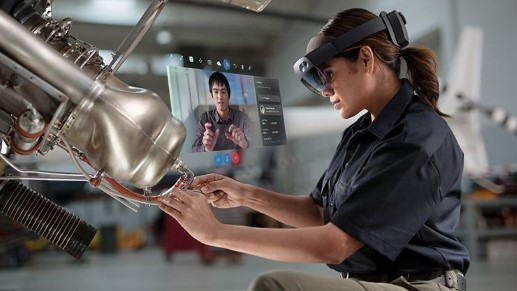

# Computer Vision Applications for Mixed Reality Headsets

Organized in conjunction with [CVPR 2019](https://cvpr2019.thecvf.com/)

Long Beach (CA)

June 17, 2019 (Afternoon) - Hyatt Regency F

## Organizers
* Marc Pollefeys
* Federica Bogo
* Johannes Schönberger
* Osman Ulusoy

## Overview

Mixed reality headsets such as the Microsoft HoloLens are becoming powerful platforms to develop computer vision applications. HoloLens Research Mode enables computer vision research on device by providing access to all raw image sensor streams -- including depth and IR. As Research Mode is now available since May 2018, we are starting to see several interesting demos and applications being developed for HoloLens. 

The goal of this workshop is to bring together students and researchers interested in computer vision for mixed reality applications. The workshop will provide a venue to share demos and applications, and learn from each other to build or port applications to mixed reality. 

We encourage submissions on the topics of (ego-centric) object recognition, hand and user tracking, activity recognition, SLAM, 3D reconstruction, scene understanding, sensor-based localization, navigation and more.

## Paper Submission
* Paper submission deadline: May 17
* Notification to authors: May 24

Paper submissions should use the CVPR template and are limited to 4 pages plus references. In addition, we encourage the authors to submit a video showcasing their application.
Note that submissions of previously published work are allowed (including work accepted to the main CVPR 2019 conference). 

Submissions can be uploaded to the CMT: https://cmt3.research.microsoft.com/CVFORMR2019

A subset of papers will be selected for oral presentation at the workshop. However, we strongly encourage all the authors to present their work during the demo session.

## Schedule
* 13:30-13:45: Welcome and Opening Remarks.
* 13:45-14:15: **Keynote talk**: Prof. Marc Pollefeys, ETH Zurich/Microsoft. Title: Egocentric Computer Vision on HoloLens.
* 14:15-14:45: **Keynote talk**: Prof. Kris Kitani, Carnegie Mellon University. Title: Egocentric Activity and Pose Forecasting.
* 14:45-15:15: **Keynote talk**: Dr. Yang Liu, California Institute of Technology. Title: Powering a Cognitive Assistant for the Blind with Augmented Reality.
* 15:15-16:15: Coffee break and demos.
* 16:15-16:45: **Keynote talk**: Prof. Kristen Grauman, University of Texas at Austin/Facebook AI Research. Title: Human-object interaction in first-person video.
* 16:45-17:15: Oral presentations:
    * Registration made easy - standalone orthopedic navigation with HoloLens. F. Liebmann, S. Roner, M. von Atzigen, F. Wanivenhaus, C. Neuhaus, J. Spirig, D. Scaramuzza, R. Sutter, J. Snedeker, M. Farshad, P. Furnstahl.
    * Learning stereo by walking around with a HoloLens. H. Zhan, Y. Pekelny, O. Ulusoy.
* 17:15-17:30: Final Remarks.
