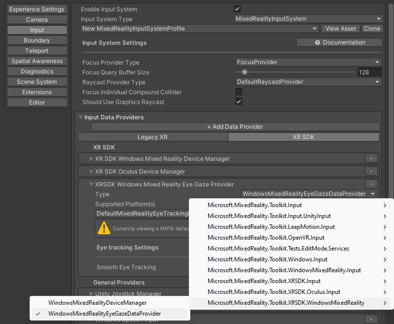
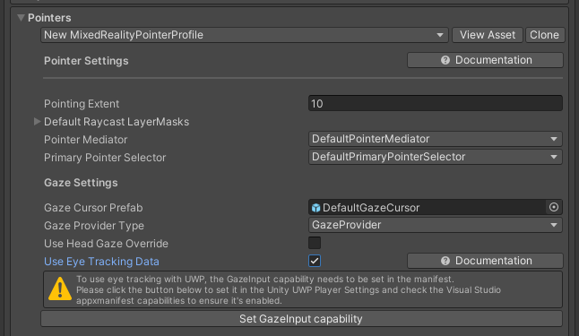

# Getting started with eye tracking in MRTK2

This page covers how to set up your Unity MRTK scene to use eye tracking in your app.
The following document assumes you're starting out with a fresh new scene.
Alternatively, you can check out our already configured [MRTK eye tracking examples](../../example-scenes/eye-tracking-examples-overview.md) with tons of great examples that you can directly build on.

## Eye tracking requirements checklist

For eye tracking to work correctly, the following requirements must be met.
If you're new to eye tracking on HoloLens 2 and to how eye tracking is set up in MRTK, don't worry!
We'll go into detail on how to address each of them further in the following sections.

1. An _'Eye Gaze Data Provider'_ must be added to the input system. This data provider provides eye tracking data from the platform.
2. The _'GazeInput'_ capability must be enabled in the application manifest.
   **This capability can be set in Unity 2019, but in Unity 2018 and earlier this capability is only available in Visual Studio and through the MRTK build tool**.
3. The HoloLens **must** be eye calibrated for the current user. Check out our [sample for detecting whether a user is eye calibrated or not](eye-tracking-is-user-calibrated.md).

### A note on the GazeInput capability

The MRTK-provided build tooling (Mixed Reality Toolkit -> Utilities -> Build Window)
can automatically enable the GazeInput capability for you. In order to do this step,
you need to make sure that the 'Gaze Input Capability' is checked on the 'Appx Build Options' tab:

This tooling will find the AppX manifest after the Unity build is completed and manually add the GazeInput capability.
**Prior to Unity 2019, this tooling is NOT active when using Unity's built-in Build Window** (File -> Build Settings).

Prior to Unity 2019, when using Unity's build window, the capability will need to be manually added after the Unity build, as follows:

1. Open your compiled Visual Studio project and then open the _'Package.appxmanifest'_ in your solution.
2. Make sure to tick the _'GazeInput'_ checkbox under _Capabilities_. If you don't see a _'GazeInput'_ capability, check that your system meets the [prerequisites for using MRTK](/windows/mixed-reality/develop/install-the-tools) (in particular the Windows SDK version).

_Note:_
You only have to do this if you build into a new build folder.
You won't need to reapply your changes if you had already built your Unity project and set up the appxmanifest before and now target the same folder again.

## Setting up eye tracking step-by-step

### Setting up the scene

Set up the _MixedRealityToolkit_ by clicking _'Mixed Reality Toolkit -> Configure…'_ in the menu bar.

### Setting up the MRTK profiles required for eye tracking

After setting up your MRTK scene, you'll be asked to choose a profile for MRTK.
You can select _DefaultMixedRealityToolkitConfigurationProfile_ and then select the _'Copy & Customize'_ option.

### Create an "eye gaze data provider"

- Click on the _'Input'_ tab in your MRTK profile.
- To edit the default one (_'DefaultMixedRealityInputSystemProfile'_), click the _'Clone'_ button next to it. A _'Clone Profile'_ menu appears. Click on _'Clone'_ at the bottom of that menu.
- Double click on your new input profile, expand _'Input Data Providers'_, and select _'+ Add Data Provider'_.
- Add the correct data provider:
  - For legacy Windows Mixed Reality
    - Under **Type** select _'Microsoft.MixedReality.Toolkit.WindowsMixedReality.Input'_ -> _'WindowsMixedRealityEyeGazeDataProvider'_
  - For Windows XR Plugin
    - Under **Type** select _'Microsoft.MixedReality.Toolkit.XRSDK.WindowsMixedReality'_ -> _'WindowsMixedRealityEyeGazeDataProvider'_
  - For OpenXR
    - Under **Type** select _'Microsoft.MixedReality.Toolkit.XRSDK.OpenXR'_ -> _'OpenXREyeGazeDataProvider'_

### Enable "Use Eye Tracking Data"

- Navigate to your MRTK configuration profile -> _'Input'_ -> _'Pointers'_
  - Clone the _'DefaultMixedRealityInputPointerProfile'_ to make changes to it.
- Find _'Use Eye Tracking Data'_ in the settings and enable it.
- You may see a _'Set GazeInput capability'_ button now and should press it to enable the UWP capability.

### Simulating eye tracking in the Unity Editor

You can simulate eye tracking input in the Unity Editor to ensure that events are correctly triggered before deploying the app to your HoloLens 2.
The eye gaze signal is simulated by using the camera's location as eye gaze origin and the camera's forward vector as eye gaze direction.
While this is great for initial testing, please note that it isn't a good imitation for rapid eye movements.
For this, it's better to ensure frequent tests of your eye-based interactions on the HoloLens 2.

1. **Enable simulated eye tracking**:
    - Click on the _'Input'_ tab in your MRTK configuration profile.
    - From there, navigate to _'Input Data Providers'_ -> _'Input Simulation Service'_.
    - Clone the _'DefaultMixedRealityInputSimulationProfile'_ to make changes to it.
    - Select the appropriate _'Default Eye Gaze Simulation Mode'_ setting.

    

2. **Disable default head gaze cursor**:
In general, we recommend that you avoid showing an eye gaze cursor or, if it's absolutely required, make it _very_ subtle.
We recommend that you hide the default head gaze cursor that's attached to the MRTK gaze pointer profile by default.
    - Navigate to your MRTK configuration profile -> _'Input'_ -> _'Pointers'_
    - Clone the _'DefaultMixedRealityInputPointerProfile'_ to make changes to it.
    - At the top of the _'Pointer Settings'_, you should assign an invisible cursor prefab to the _'Gaze Cursor Prefab'_. You can do this by selecting the _'EyeGazeCursor'_ prefab from the MRTK Foundation.

### Enabling eye-based gaze in the gaze provider

In HoloLens v1, head gaze was used as the primary pointing technique.
While head gaze is still available via the _GazeProvider_ in MRTK, which is attached to your [Camera](https://docs.unity3d.com/ScriptReference/Camera.html), you can use eye gaze instead by selecting the _'IsEyeTrackingEnabled'_ checkbox in the gaze settings of the input pointer profile.

>[!NOTE]
>Developers can toggle between eye-based gaze and head-based gaze in code by changing the _'IsEyeTrackingEnabled'_ property of _'GazeProvider'_.  

>[!IMPORTANT]
>If any of the eye tracking requirements are not met, the application will automatically fall back to head-based gaze.

### Accessing eye gaze data

Now that your scene is set up to use eye tracking, let's take a look at how to access it in your scripts:
[Accessing eye tracking data via EyeGazeProvider](eye-tracking-eye-gaze-provider.md) and [eye-supported target selections](eye-tracking-target-selection.md).

### Testing your Unity app on a HoloLens 2

Building your app with eye tracking should be similar to how you would compile other HoloLens 2 MRTK apps. Be sure that you've enabled the _'Gaze Input'_ capability as described above in the section [_A note on the GazeInput capability_](#a-note-on-the-gazeinput-capability).

#### Ensure project is configured for HoloLens 2

Make sure you've properly configured your project by reviewing the configuration steps covered in [Set up an OpenXR project with MRTK](/windows/develop/unity/new-openxr-project-with-mrtk.md).

Key points to think about:

- Review key settings in the **Project Settings** window.
  - Ensure Plugin Providers are set correctly
- Resolve **warning triangles**.
  - Interaction profiles should be set
  - OpenXR Feature Groups should be properly selected

#### Eye calibration

Don't forget to run through the eye calibration on your HoloLens 2.
The eye tracking system won't return any input if the user isn't calibrated.
The easiest way to get to the calibration is by flipping the visor up and then back down.
A system notification should appear that welcomes you as a new user and asks you to go through the eye calibration.
Alternatively you can find the eye calibration in the system settings: Settings > System > Calibration > Run eye calibration.

#### Eye tracking permission

When you start the app on your HoloLens 2 for the first time, a prompt should pop up asking the user for permission to use eye tracking.
If the prompt isn't showing up, that's usually an indication that the _'GazeInput'_ capability wasn't set.

After the permission prompt showed up once, it won't show up automatically again.
If you _"denied eye tracking permission"_, you can reset this in Settings -> Privacy -> Apps.

---

This should get you started with using eye tracking in your MRTK Unity app.
Don't forget to check out [our MRTK eye tracking tutorials and samples](../../example-scenes/eye-tracking-examples-overview.md) demonstrating how to use eye tracking input and conveniently providing scripts that you can reuse in your projects.

---
[Back to "Eye tracking in the MixedRealityToolkit"](eye-tracking-main.md)
