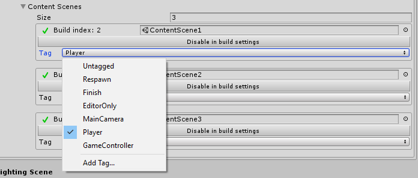
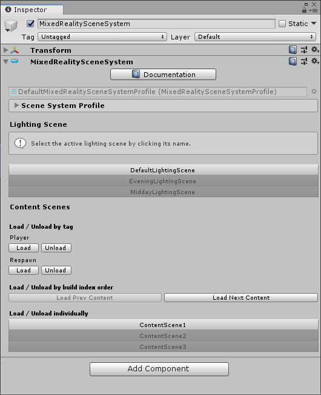

# Scene system content loading &#8212; MRTK2

All content load operations are asynchronous, and by default all content loading is additive. Manager and lighting scenes are never affected by content loading operations. For information about monitoring load progress and scene activation, see [Monitoring Content Loading](scene-system-load-progress.md).

## Loading content

To load content scenes use the `LoadContent` method:

```c#
IMixedRealitySceneSystem sceneSystem = MixedRealityToolkit.Instance.GetService<IMixedRealitySceneSystem>();

// Additively load a single content scene
await sceneSystem.LoadContent("MyContentScene");

// Additively load a set of content scenes
await sceneSystem.LoadContent(new string[] { "MyContentScene1", "MyContentScene2", "MyContentScene3" });
```

## Single scene loading

The equivalent of a single scene load can be achieved via the optional `mode` argument. `LoadSceneMode.Single` will first unload all loaded content scenes before proceeding with the load.

```c#
IMixedRealitySceneSystem sceneSystem = MixedRealityToolkit.Instance.GetService<IMixedRealitySceneSystem>();

// ContentScene1, ContentScene2 and ContentScene3 will be loaded additively
await sceneSystem.LoadContent("ContentScene1");
await sceneSystem.LoadContent("ContentScene2");
await sceneSystem.LoadContent("ContentScene3");

// ContentScene1, ContentScene2 and ContentScene3 will be unloaded
// SingleContentScene will be loaded additively
await sceneSystem.LoadContent("SingleContentScene", LoadSceneMode.Single);
```

## Next / previous scene loading

Content can be singly loaded in order of build index. This is useful for showcase applications that take users through a set of demonstration scenes one-by-one.


Note that next / prev content loading uses LoadSceneMode.Single by default to ensure that the previous content is unloaded.

```c#
IMixedRealitySceneSystem sceneSystem = MixedRealityToolkit.Instance.GetService<IMixedRealitySceneSystem>();

if (nextSceneRequested && sceneSystem.NextContentExists)
{
    await sceneSystem.LoadNextContent();
}

if (prevSceneRequested && sceneSystem.PrevContentExists)
{
    await sceneSystem.LoadPrevContent();
}
```

`PrevContentExists` will return true if there is at least one content scene that has a lower build index than the lowest build index currently loaded. `NextContentExists` will return true if there is at least one content scene that has a higher build index than the highest build index currently loaded.

If the `wrap` argument is true, content will loop back to the first / last build index. This removes the need to check for next / previous content:

```c#
IMixedRealitySceneSystem sceneSystem = MixedRealityToolkit.Instance.GetService<IMixedRealitySceneSystem>();

if (nextSceneRequested)
{
    await sceneSystem.LoadNextContent(true);
}

if (prevSceneRequested)
{
    await sceneSystem.LoadPrevContent(true);
}
```

## Loading by tag



It's sometimes desirable to load content scenes in groups. Eg, a stage of an experience may be composed of multiple scenes, all of which must be loaded simultaneously to function. To facilitate this, you can tag your scenes and then load them or unload them with that tag.

```c#
IMixedRealitySceneSystem sceneSystem = MixedRealityToolkit.Instance.GetService<IMixedRealitySceneSystem>();

await LoadContentByTag("Stage1");

// Wait until stage 1 is complete

await UnloadContentByTag("Stage1");
await LoadContentByTag("Stage2);
```

Loading by tag can also be useful if artists want to incorporate / remove elements from an experience without having to modify scripts. For instance, running this script with the following two sets of tags produces different results:

```c#
IMixedRealitySceneSystem sceneSystem = MixedRealityToolkit.Instance.GetService<IMixedRealitySceneSystem>();

await LoadContentByTag("Terrain");
await LoadContentByTag("Structures");
await LoadContentByTag("Vegetation");
```

### Testing content

Scene Name | Scene Tag | Loaded by script
---|---|---
DebugTerrainPhysics | Terrain | •
StructureTesting | Structures | •
VegetationTools | Vegetation | •
Mountain | Terrain | •
Cabin | Structures | •
Trees | Vegetation | •

### Final content

Scene Name | Scene Tag | Loaded by script
---|---|---
DebugTerrainPhysics | DoNotInclude |
StructureTesting | DoNotInclude |
VegetationTools | DoNotInclude |
Mountain | Terrain | •
Cabin | Structures | •
Trees | Vegetation | •

---

## Editor behavior

You can perform all these operations in editor and in play mode by using the Scene System's [service inspector.](../../configuration/mixed-reality-configuration-guide.md#editor-utilities) In edit mode scene loads will be instantaneous, while in play mode you can observe loading progress and use [activation tokens.](scene-system-load-progress.md)


