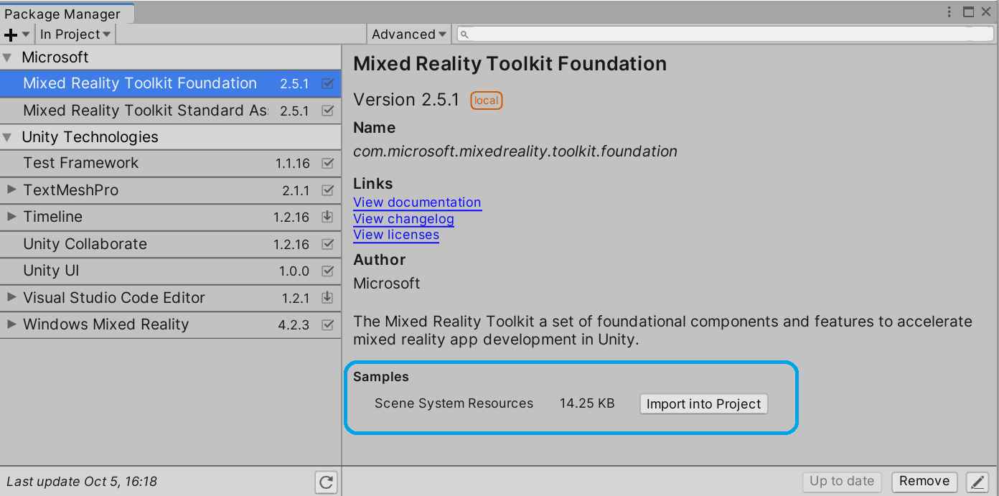
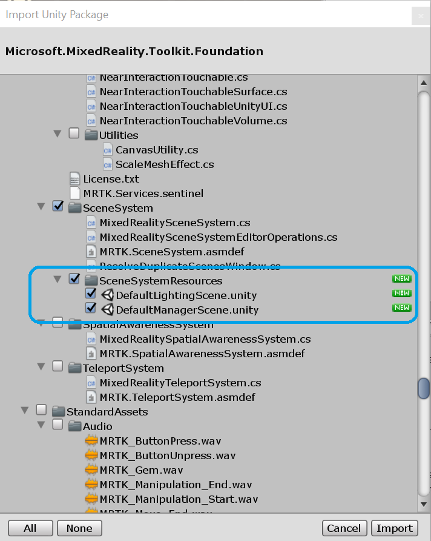

# Scene system getting started &#8212; MRTK2

## When to use the scene system

If your project consists of a single scene, the Scene System probably isn't necessary. It is most useful when one or more of the following are true:

- Your project has multiple scenes.
- You're used to single scene loading, but you don't like the way it destroys the MixedRealityToolkit instance.
- You want a simple way to additively load multiple scenes to construct your experience.
- You want a simple way to keep track of load operations in progress or a simple way to control scene activation for multiple scenes being loaded at once.
- You want to keep lighting consistent and predictable across all your scenes.

## Scene System Resources

By default, the Scene System utilizes a pair of scene objects (DefaultManagerScene and DefaultLighting scene). If either of these scenes cannot be located,
a message will appear in the Scene System profile inspector.

>![Note]
> If the project is using custom manager and lighting scenes, this message can be safely ignored.

The following sections describe now to resolve this message, based on which method was used to import Mixed Reality Toolkit.

### Unity Package Manager (UPM)

In the Mixed Reality Toolkit UPM packages, the scene system resources are packaged as a sample. Due to UPM packages being immutable, Unity
is unable to open the necessary scene file unless they are explicitly imported into the project.

To import use the following steps:

- Select **Window** > **Package Manager**
- Select **Mixed Reality Toolkit Foundation**
- Locate **Scene System Resources** in the **Samples** section

  

- Select **Import**

### Asset (.unitypackage) files

If the SceneSystemResources folder has been deleted, or was deselected during import, it can be recovered using the following steps:

- Select **Assets** > **Import Package** > **Custom Package**
- Open the **Microsoft.MixedReality.Toolkit.Foundation** package
- Ensure that **Services/SceneSystem/SceneSystemResources** and all child options are selected

  

- Select **Import**

## How to use the scene system

- [Scene Types](scene-system-scene-types.md)
- [Content Scene Loading](scene-system-content-loading.md)
- [Monitoring Content Loading](scene-system-load-progress.md)
- [Lighting Scene Loading](scene-system-lighting-scenes.md)

## Editor settings

By default, the Scene System enforces several behaviors in the Unity editor. If you find any of these behaviors heavy-handed, they can be disabled in the **Editor Settings** section of your Scene System profile.

- `Editor Manage Build Settings:` If true, the service will update your build settings automatically, ensuring that all manager, lighting and content scenes are added. Disable this if you want total control over build settings.

- `Editor Enforce Scene Order:` If true, the service will ensure that the manager scene is displayed first in scene hierarchy, followed by lighting and then content. Disable this if you want total control over scene hierarchy.

- `Editor Manage Loaded Scenes:` If true, the service will ensure that the manager, content and lighting scenes are always loaded. Disable if you want total control over which scenes are loaded in editor.

- `Editor Enforce Lighting Scene Types:` If true, the service will ensure that only the lighting-related components defined in `PermittedLightingSceneComponentTypes` are allowed in lighting scenes. Disable if you want total control over the content of lighting scenes.

