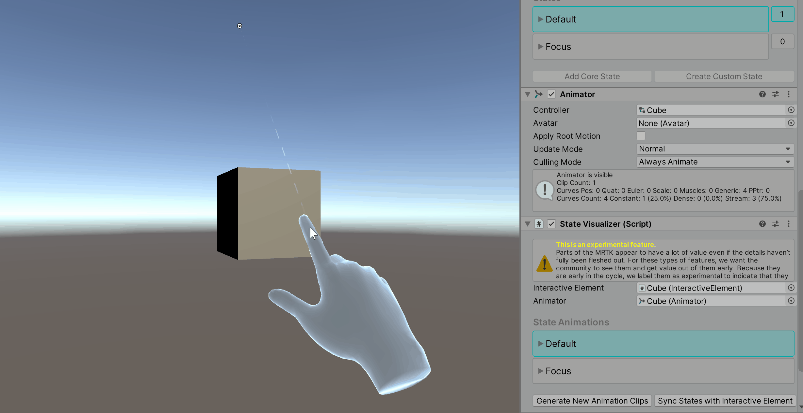
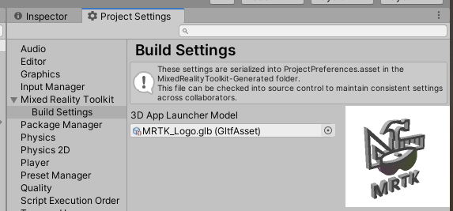
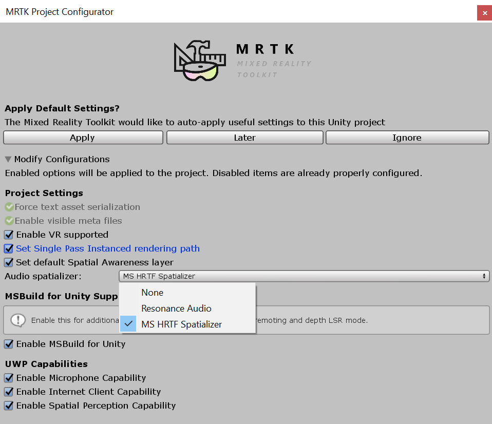

# Microsoft Mixed Reality Toolkit 2.6 Release Notes

> [!IMPORTANT]
> There is a known compiler issue that impacts applications built for Microsoft HoloLens 2 using
> ARM64. This issue is fixed by updating Visual Studio 2019 to version 16.8 or later. If you are unable to update Visual Studio,
> please import the `com.microsoft.mixedreality.toolkit.tools` package to apply a workaround.

## What's new in 2.6.2

### Corrects parenting of the spatial mesh

Fixes the [issue](https://github.com/microsoft/MixedRealityToolkit-Unity/pull/9819) where spatial meshes were not being properly located after the Mixed Reality Playspace object was moved (ex: via a teleport).

## What's new in 2.6.1

### Fixes OpenXR not running on HoloLens 2 / UWP

Fixes a regression that prevented MRTK's OpenXR support from running on UWP.

### Fixes Leap Motion ObjectManipulator not rotating

Fixes a regression where a Leap Motion hand's rotation was not taken into account by the ObjectManipulator script.

### Sample scene updates

Updates the scene understanding sample scene to correctly reflect the shipped state of the Unity plugin. Also updates the sample to no longer have a dependency on the spatial awareness sample scene being imported. Before updating to 2.6.1 you should delete the imported scene understanding and spatial awareness samples if they are present in your project to avoid possible conflicts. If you did not remove those samples and do see conflicts related to those in the console, please remove both samples (or the `Assets/Samples/Mixed Reality Toolkit Examples` folder) and then try importing again.

Updates the dialog example scene to correctly describe the current dialog scenarios.

## What's new in 2.6.0

> [!VIDEO https://www.youtube.com/embed/qfONlUCSWdg]
 

### Add support for OpenXR

Initial support for Unity's OpenXR preview package and Microsoft's Mixed Reality OpenXR package has been added. See [the MRTK/XRSDK getting started page](../configuration/getting-started-with-mrtk-and-xrsdk.md), [Unity's forum post](https://forum.unity.com/threads/unity-support-for-openxr-in-preview.1023613/), or [Microsoft's documentation](/windows/mixed-reality/develop/unity/openxr-getting-started) for more information.

> [!IMPORTANT]
> OpenXR in Unity is only supported on Unity 2020.2 and higher.
>
> Currently, it also only supports x64 and ARM64 builds.

### Asset swap utility

Swap multiple assets in a Unity scene with the new [Asset Swap utility](../features/tools/asset-swap-utility.md).

### HP Motion Controllers now supported with MRTK

Controllers for the HP Reverb G2 now work natively with MRTK.

### Experimental Interactive Element + State Visualizer

Interactive Element is a simplified centralized entry point to the MRTK input system. It contains state management methods, event management and the state setting logic for Core Interaction States. For more information see [Interactive Element Documentation](../features/experimental/interactive-element.md).

The State Visualizer is an animation component that depends on Interactive Element. This component creates Animation Clips, sets keyframes and generates an Animator State Machine. For more information see [State Visualizer Documentation](../features/experimental/interactive-element.md#state-visualizer-experimental)

### Teleportation with the teleport gesture now supported on all platforms

Users can now use the teleport gesture to move around their play space across all platforms. To teleport with a controller on MR devices with default configurations, use the thumbstick. To teleport with
articulated hands, make a gesture with your palm facing up with the index and thumb sticking outwards, completing the teleport by curling the index finger. To teleport with input simulation, please
see our updated [Input Simulation Service documentation](../features/input-simulation/input-simulation-service.md).

### Scene Understanding now available in MRTK as an experimental spatial awareness observer

Experimental support of [Scene Understanding](/windows/mixed-reality/scene-understanding) is introduced in MRTK 2.6. Users can incorporate the scene understanding capabilities of HoloLens 2 as a spatial awareness observer in MRTK based projects. Please read the [Scene Understanding documentation](../features/spatial-awareness/scene-understanding.md) for more information.

> [!IMPORTANT]
> Scene Understanding is only supported on HoloLens 2 and Unity 2019.4 and higher.
>
> This feature requires the Scene Understanding package, which is now available via the [Mixed Reality Feature Tool](https://aka.ms/MRFeatureTool).
> When using the Mixed Reality Feature Tool or otherwise importing via UPM, please import the Demos - SpatialAwareness sample before importing the Experimental - SceneUnderstanding sample due to a dependency issue. Please see [this GitHub issue](https://github.com/microsoft/MixedRealityToolkit-Unity/issues/9431) for more information.

### Runtime profile switching support

MRTK now allows profile switching both before the initialization of the MRTK instance (i.e. Pre MRTK initialization profile switch) and after a profile has been in active use (i.e. Active profile switch). The former switch can be used to enable select components based on capabilities of the hardware, while the latter can be used to modify experience as the user enters a subpart of the application. Please read the [documentation on profile switching](../configuration/mixed-reality-configuration-guide.md#changing-profiles-at-runtime) for more information and code samples.

### Directional indicator and follow solvers graduated from experimental

Two new solvers are ready for use with mainline MRTK.

### Hand Coach graduated from experimental

The Hand Coach feature is now ready for use with mainline MRTK.

### Dialog controls graduated from experimental

Dialog controls are now ready for use with mainline MRTK.

### Pulse shader graduated from experimental

The Pulse shader scripts have graduated from experimental. For more information see: [Pulse Shader Documentation](../features/rendering/pulse-shader.md)

### Input Recording Service improvements

`InputRecordingService` and `InputPlaybackService` can now record and play back eye gaze input. Recording has been optimized to ensure a consistent framerate throughout the recording period while recording file size and save time are also reduced by about 50%. Saving and loading of recording files can now be performed asynchronously. Note the file format of the recording has changed in this MRTK version, please see [here](../features/input-simulation/input-animation-file-format.md) for more information on the new version 1.1 specifications.

### Reading mode

Added support for [reading mode](/hololens/hololens2-display#what-improvements-are-coming-that-will-improve-hololens-2-image-quality) on HoloLens 2. Reading mode reduces the system's field of view but eliminates a scaling of Unity's output. A pixel rendered by Unity will correspond to a projected pixel on HoloLens 2. Application authors should do tests with multiple individuals to be sure this is a tradeoff they want in their app.

### Support for 3D app launchers on UWP

Adds the ability to set a [3D app launcher](/windows/mixed-reality/distribute/3d-app-launcher-design-guidance) for UWP. This setting is exposed both in the MRTK Build Window and the MRTK Project Settings, under Build Settings. It's automatically written into the project during the build in Unity.

## Breaking changes

### Certain fields of imported GLTF objects are now capitalized

Due to deserialization related issues some fields of imported GLTF objects are now starting with capital letters. The affected fields are (in their new names): `ComponentType`, `Path`, `Interpolation`, `Target`, `Type`, `Mode`, `MagFilter`, `MinFilter`, `WrapS`, `WrapT`.

### Input animation binary file has an updated version 1.1 format

Input animation binary file, used by `InputRecordingService` and `InputPlaybackService`, now has an updated file format to enable the optimizations made to those two services. Please see [here](../features/input-simulation/input-animation-file-format.md) for more information on the new version 1.1 specifications.

### MSBuild for Unity support

Support for MSBuild for Unity has been removed as of the 2.5.2 release, to align with [Unity's new package guidance](https://forum.unity.com/threads/updates-to-our-terms-of-service-and-new-package-guidelines.999940/).

## Known issues

### OpenXR

There's currently a known issue with Holographic Remoting and OpenXR, where hand joints aren't consistently available.
Additionally, the eye tracking sample scenes aren't currently compatible, though eye tracking _does_ work.

### Some Mixed Reality Toolkit Standard Shader features require the Foundation package

When imported via the Unity Package Manager, the MRTK Standard Shader utilities scripts (ex: HoverLight.cs) are not co-located with the shader in the Standard Assets package. To access this functionality, applications will require the Foundation package to be imported.

### CameraCache may create a new camera on shutdown

In some situations (e.g. when using the LeapMotion provider in the Unity Editor), it is possible for the CameraCache to re-create the MainCamera on shutdown. Please see [this issue](https://github.com/microsoft/MixedRealityToolkit-Unity/issues/8459) for more information.

### FileNotFoundException when examples are imported via Unity Package Manager

Depending on the length of the project path, importing examples via Unity Package Manager may generate FileNotFoundException messages in the Unity Console. The
cause of this is the path to the "missing" file being longer than MAX_PATH (256 characters). To resolve, please shorten the length of the project path.

### No spatializer was specified. The application will not support Spatial Sound

A "No spatializer was specified" warning will appear if an audio spatializer is not configured. This can occur if no XR package is installed, as Unity includes spatializers in these packages.

To resolve, please ensure that:

- **Window** > **Package Manager** has one or more XR packages installed
- **Mixed Reality Toolkit** > **Utilities** > **Configure Unity Project** and make a selection for **Audio Spatializer**

  

### NullReferenceException: Object reference not set to an instance of an object (SceneTransitionService.Initialize)

In some situations, opening `EyeTrackingDemo-00-RootScene` may cause a NullReferenceException in the Initialize method of the SceneTransitionService class.
This error is due to the Scene Transition Service's configuration profile being unset. To resolve, please use the following steps:

- Navigate to the `MixedRealityToolkit` object in the Hierarchy
- In the Inspector window, select `Extensions`
- If not expanded, expand `Scene Transition Service`
- Set the value of `Configuration Profile` to **MRTKExamplesHubSceneTransitionServiceProfile**

### Oculus Quest

There is currently a known issue for using the [Oculus XR plugin with when targeting Standalone platforms](https://forum.unity.com/threads/unable-to-start-oculus-xr-plugin.913883/). Check the Oculus bug tracker/forums/release notes for updates.

The bug is signified with this set of 3 errors:

### UnityUI and TextMeshPro

There's a known issue for newer versions of TextMeshPro (1.5.0+ or 2.1.1+), where the default font size for dropdowns and bold font character spacing has been altered.

This can be worked around by downgrading to an earlier version of TextMeshPro. See [issue #8556](https://github.com/microsoft/MixedRealityToolkit-Unity/issues/8556)
for more details.
