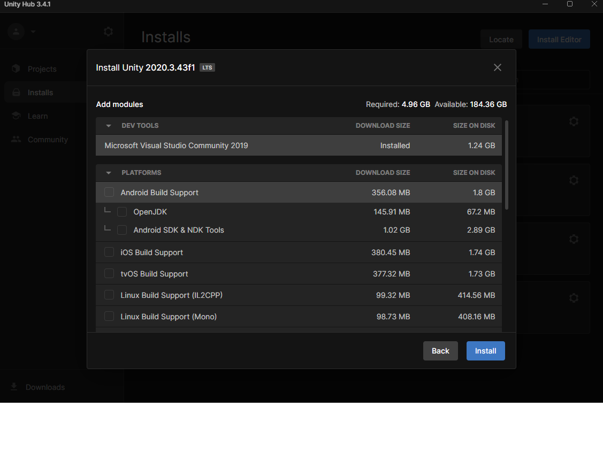

# Setting up your development environment

Before setting up a Unity Project with MRTK3, make sure you have the following prerequisites.

- A Windows 10 or 11 PC
- Visual Studio 2022 with the required workloads (as noted in the [Installation Checklist](/windows/mixed-reality/develop/install-the-tools?tabs=unity))
- Windows 10 SDK 10.0.18362.0 or later
- Unity Hub with Unity 2022.3 LTS or Unity 2021.3 LTS installed

If your target platform is a HoloLens device, your Unity installation needs to include the Universal Windows Platform Support Module.

If your target platform is a Quest device, your Unity installation needs to include the Android Build Support Module and its submodules. More more information specifics, see the [Oculus Developer documentation](https://developer.oculus.com/documentation/unity/book-unity-gsg/#install-unity-editor).

## Next steps

After setting up the development environment, there are few options for creating a Unity Project with MRTK3.

- [Starting from a Template Project](setup-template.md): This guide walks you through cloning a template project, which is preconfigured to consume all MRTK3 packages. This template project is set up with  Unity project settings for running your application on a device.
- [Starting from a New Project](setup-new-project.md): This guide walks you through adding vital MRTK3 packages to a new Unity project. The guide also helps you set up the Unity project settings for running your application on a device.