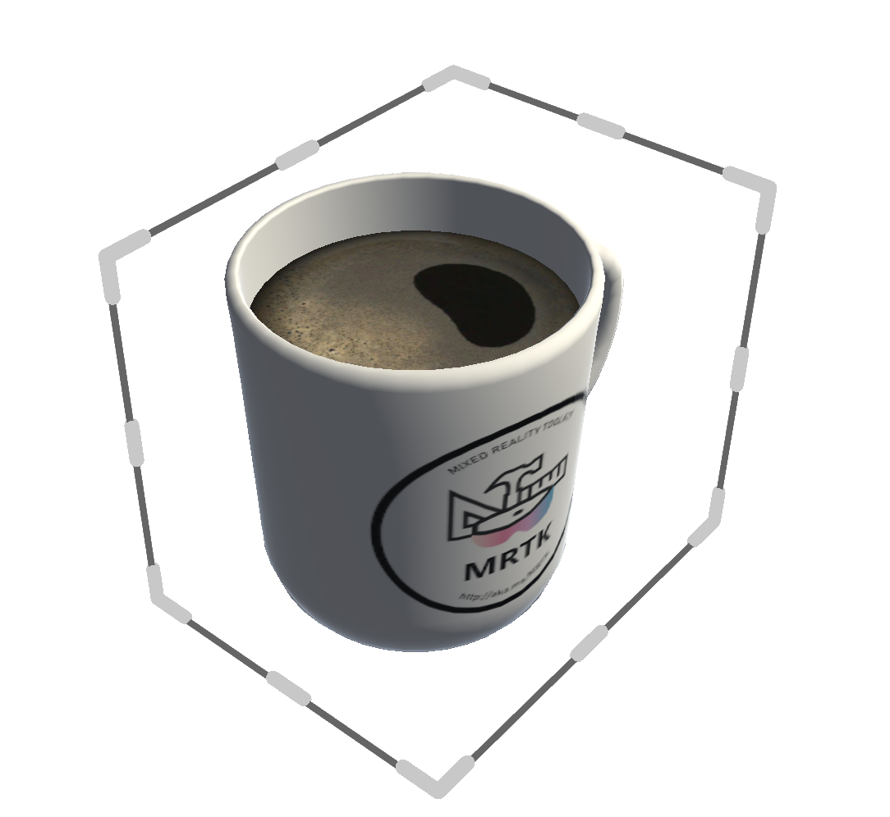
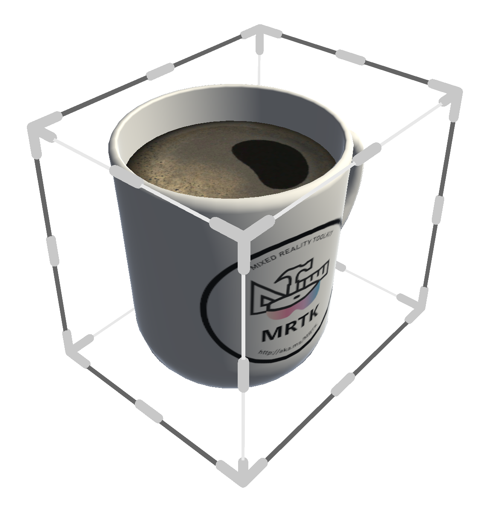
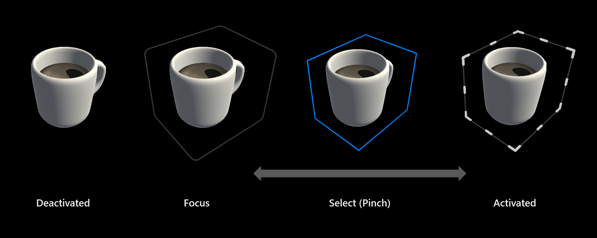
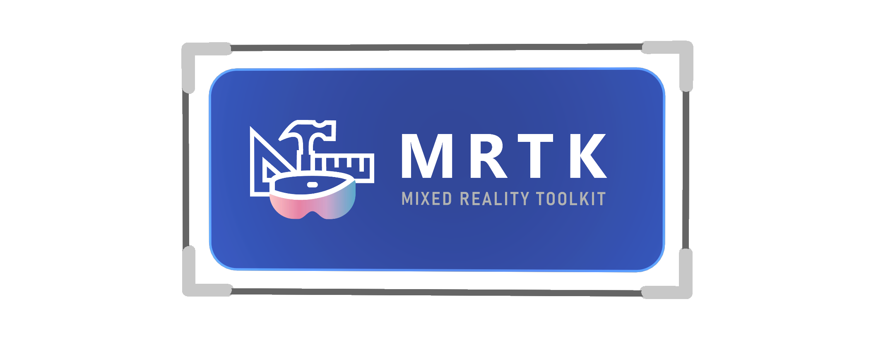

# BoundsControl &#8212; MRTK3

BoundsControl provides an automatically-sized bounding box, along with manipulation affordances for rotation and scale.

In MRTK 2.x, BoundsControl was mainly runtime-generated through the use of configuration ScriptableObjects. In MRTK3, the setup and customization of BoundsControl has been significantly simplified. The bounds visuals and handles are simply a customizable prefab that BoundsControl instantiates at runtime. Developers can tweak and customize the visuals prefab, or even build new bounds visuals from scratch. We provide standard bounds visuals implementations, following the new Mixed Reality Design Language.

The new visuals offer streamlined visual feedback that illustrates the user's intent and manipulation of the object with minimally intrusive visual noise.

## Setup

Simply add BoundsControl to an existing object and populate the `BoundsVisualsPrefab` reference with the bounds visuals you'd like to use. We provide a few different pre-built bounds visuals for you to use.

> [!IMPORTANT]
> We strongly recommend that developers add **MinMaxScaleConstraint** to prevent the user from scaling the object to an unusably small or large size.

To use the bounds visuals' intention and focus effects, you must have a `StatefulInteractable` on the object. If the interactable isn't automatically detected, you can specify the connection in the BoundsControl inspector.

> [!NOTE]
> **We recommend developers use ObjectManipulator alongside BoundsControl** to offer users direct manipulation in addition to the affordance-based manipulation. ObjectManipulator can serve as the `StatefulInteractable` for the hover/focus states that the bounds visuals respond to.

## Bounds visuals prefabs

We offer several pre-built bounds visuals for use with BoundsControl. Developers are encouraged to make prefab variants of these visuals and customize them to fit their needs. The handle animations and states are powered by StateVisualizer, allowing developers to further customize the look and feel of the affordances.

:::row:::
    :::column:::
        ### Handle occlusion style 
        These bounds visuals offer a simplified visual design with fewer distractions for the user. Only the relevant handles along the edges of the bounds will be visible. The bounds visuals contract, expand, and change color/thickness depending on user intent and selection progress. We strongly recommend using this bounds visual style. 
    :::column-end:::
        :::column:::
        
    :::column-end:::
:::row-end:::
:::row:::
    :::column:::
        ### Intention-only 
        In some contexts, handles may be undesirable, and developers may want to use the bounds visuals alone as a delightful indicator of user intention. While this prefab does the job, the same effect can be achieved with any of the other bounds visuals by selecting HandleType.None. We've found that the squeezable bounds visuals are a satisfying and delightful visual feedback element for many different contexts, not just for handle-based manipulation. 
    :::column-end:::
        :::column:::
        
    :::column-end:::
:::row-end:::
:::row:::
    :::column:::
        ### Legacy style 
        These bounds visuals show all handles and edges of the box. This more closely matches the legacy design language and the previous behavior seen in MRTK 2.x; however, this design can be more distracting for users due to unnecessary visual noise. In addition, the presence of the handles that are in front of the object (and behind) can cause problems with the indirect gaze-pinch manipulation. We don't recommend using this style for new applications, especially those taking advantage of gaze targeting. 
    :::column-end:::
        :::column:::
        
    :::column-end:::
:::row-end:::

## Interaction design

In the current iteration, we offer a simple activation/deactivation interaction. By clicking the bounds in-place (in other words, selecting the object, not moving it, and releasing it) the handles can be toggled on and off. The distance tolerance for this check can be adjusted with `DragToggleThreshold`, and this activation behavior itself can be enabled/disabled with the `ToggleHandlesOnClick` property.

The handles can be manually activated or deactivated from code at any time by setting `HandlesActive`.

## Automatic bounds calculation

BoundsControl will attempt to calculate the bounds of the associated object automatically. If a specific bounds shape is desired, check the `OverrideBounds` option and specify the bounds object directly. The bounds calculation system will only calculate the bounds for the specified override object.

The `BoundsCalculationMethod` influences how the algorithm calculates bounds. If the visual shape of the enclosed object doesn't necessarily match the collider, or the opposite is true, developers can adjust the calculation method to prefer using renderer or collider bounds, or a combination of both.

Regardless of calculation method, the `Padding` option will pad the bounds uniformly in world units. When the bounds are flattened, the flattened axis is not padded.

## Flattening

BoundsControl can be used for manipulating 2D content as well. If `FlattenMode` is set to `Auto`, the BoundsControl will flatten itself to a 2D rectangular bounds if the object is sufficiently flat along any axis. If the object isn't quite flat enough, but you would still like rectangular bounds affordances, `FlattenMode.Always` will always flatten the BoundsControl along the skinniest axis. Conversely, `FlattenMode.Never` will prevent the BoundsControl from flattening, even when the object is very thin.

## Manipulation options

The manipulation behaviour of BoundsControl can be adjusted in several ways. The `RotateAnchor` option controls the pivot point around which the BoundsControl is rotated when using the rotation affordances. Some objects' pivot points are far from their visual center, which can cause discomfort and imprecision when manipulating with the rotation handles. Specifying `BoundsCenter` for the `RotateAnchor` will cause the BoundsControl to always rotate around the geometric center of the computed bounds rather than the actual origin of the object.

Scaling behavior can be set to either `Uniform` or `Non Uniform`. In Uniform mode, all axes of the object are scaled together, maintaining aspect ratio and appearance. Non-uniform scaling allows each axis of the object to be scaled independently.
