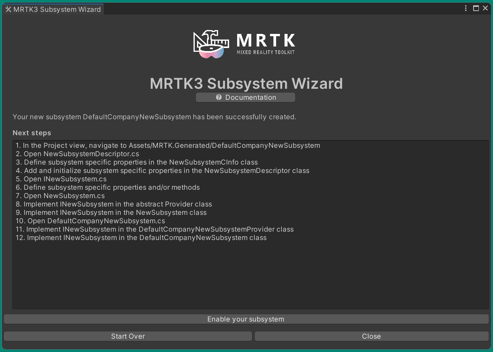
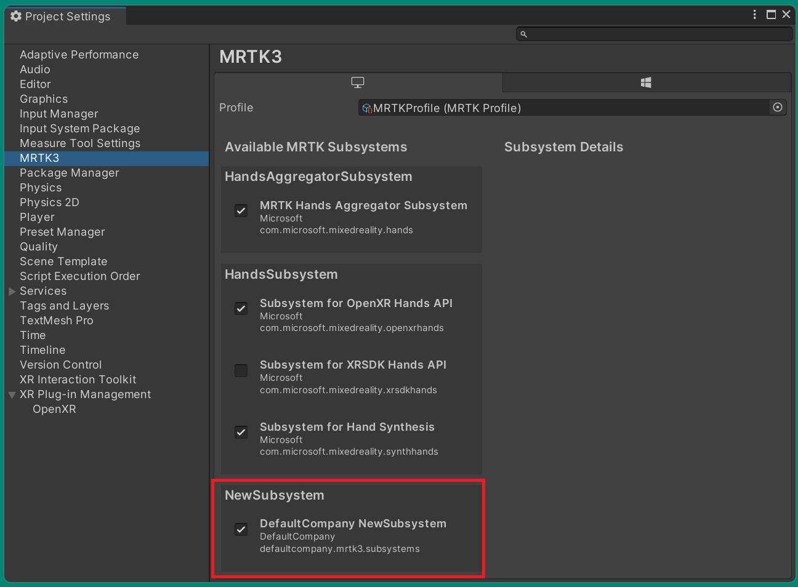

# Subsystem Wizard &#8212; MRTK3

Welcome to the Mixed Reality Toolkit Subsystem Wizard. This tool is used to extend the functionality of MRTK3 via a custom Unity XR Subsystem. This document describes the Subsystem Wizard, its UI and how to add your custom feature to MRTK3.

> [!NOTE]
> As a general rule, it is recommended to use subsystems to implement platform or provider abstractions.

To use the Subsystem Wizard, you must first import the MRTK3 Tools package using the [Mixed Reality Feature Tool](https://aka.ms/mrfeaturetool).

## Getting Started

To get started creating a new subsystem, select the `Subsystem Wizard` item from the **MRTK3** > **Utilities** menu.


Once started, the Subsystem Wizard will ask you for some information; namely the name of your organization, the base name for the subsystem and if the subsystem requires configuration data.


### Organization name

By default, the Subsystem Wizard will read the Unity Player settings and ensure the organization name matches the project's company name. This value can be overwritten to be any valid C# identifier.


### Base class name

All subsystems will be generated with a base class. This structure is required by the current architecture and makes it easy to implement platform or provider specific versions of a subsystem. It is recommended to use the name of the subsystem (ex: "ScentSubsystem") for the base class name.


### Adding a subsystem configuration

If your subsystem is to be configurable, select the `Add subsystem configuration` box.


### Generated names

The wizard automatically creates the names of specific elements. These names can be overridden after the wizard completes, using your favorite text editor.


## Preparing to generate


### Skipping file generation subsystem class

While it is most often not recommended to skip the generation of one or more subsystem files, there are some scenarios where it may be useful (ex: you wish to regenerate a single file).

> [!NOTE]
> The Subsystem Wizard will not overwrite existing files. To regenerate a file, it must first be deleted.

Use the `Skip` option next to the desired file(s) to instruct the wizard to suppress generation.

## Finishing your subsystem



Once complete, the Subsystem Wizard will list the set of steps required to complete your subsystem's implementation. The set of steps listed may vary based on the wizard settings.


### Add your code

The generated code contains indications of where required (and optional) code should be added. These indicators are in the form of a comment beginning with the word TODO and containing a description of the code to be added. For example:

```c#
// TODO: Apply the configuration to the provider.
```

### Enable the subsystem

Once your subsystem is ready, you can enable it in the MRTK3 profile by visiting **Edit** > **Project Settings** > **MRTK3**.


