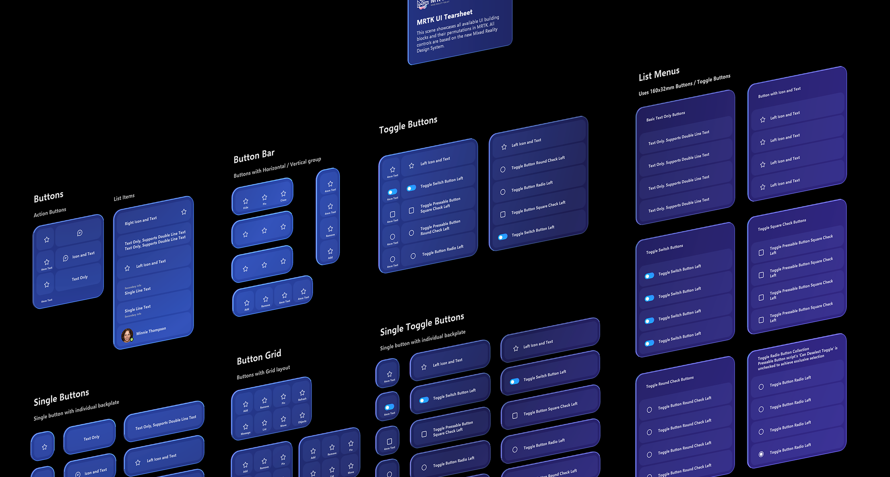

# Button (Non-Canvas) &#8212; MRTK3

If you're building user interfaces with an unusually large number of controls, or in instances where using RectTransform-based controls is infeasible for layout or performance reasons, MRTK3 offers non-Canvas-based prefabs.

[!INCLUDE]

## Example scenes

If you're using the development template project, several example scenes are available that demonstrate the available non-Canvas button prefabs.

**UITearSheet.unity** shows all available non-Canvas-based button prefab variants in MRTK.

## Prefabs (Non-Canvas)

Non-canvas buttons aren't resizable; as a result, a large number of button prefabs are provided in many permutations of size and features. These prefabs are named in the format: **PressableButton_SIZE_STYLE**. For example,

- **PressableButton_32x32mm_IconAndText**: 32x32mm size button with icon and text
- **PressableButton_128x32mm_SinglelineTextWithSubtitle**: 128x32mm size wide button with single line text + subtitle text

## Structure (Non-Canvas)

The following screenshot shows the structure of a non-canvas-based button.

## See more

For more information, see the [Canvas-based Button documentation](../../../mrtk3-uxcomponents/packages/uxcomponents/button.md) for details on the `PressableButton` class and design recommendations for implementing the Mixed Reality Design Language.