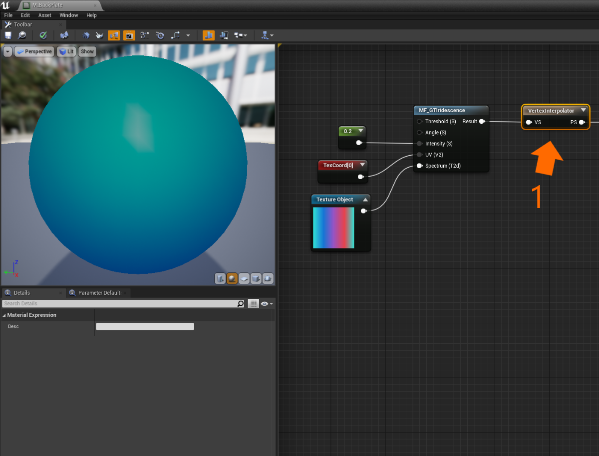

# Effects

Graphics Tools contains a handful of effects that are commonly found in Mixed Reality applications. Effects normally exist as a single [material function](https://docs.unrealengine.com/RenderingAndGraphics/Materials/Functions/index.html) which can be dropped into a material graph. Expect the library of effects to grow over time with subsequent Graphics Tools releases.

## Iridescence

Iridescence is a visual phenomenon that occurs when a surface gradually changes color when viewed from a different angle (or if lighting angles change). In nature this can be seen on soap bubbles, hummingbird feathers, and on oil slicks. Mixed Reality applications normally apply this effect to UI back plates to provide visual contrast and interest. 

### Example material

Example usage of the `MF_GTIridescence` material function can be found within the `GraphicsToolsProject\Plugins\GraphicsToolsExamples\Content\MaterialGallery\Materials\M_ShaderBallIridescent.uasset` material.

### Implementation details

To apply an approximation of iridescence on any material use the `MF_GTIridescence` material function. The `MF_GTIridescence` material function takes a handful of inputs:

* `Threshold` defines the range when sampling the `Spectrum` texture. (The default value is recommended for most scenarios.)
* `Angle` controls the "roll" of the `Spectrum` texture in `UV` space.
* `Intensity` scales how intense the final effect is.
* `UV` should normally be connected to the first texture coordinate.
* The `Spectrum` input is a texture (`TextureObject`) which defines a color gradient look up table. Below is the spectrum texture used on back plates within the Hololens 2 shell, and can be found at `GraphicsToolsProject\Plugins\GraphicsToolsExamples\Content\Common\Materials\T_IridescenceRamp_01_D.uasset`.
    

To improve performance the `MF_GTIridescence` material function is intended to be invoked in the vertex shader by connecting the output to a `VertexInterpolator` node. (1)

## Rim lighting

Also referred to Fresnel lighting, rim lighting illuminates pixels with normals which face nearly perpendicular to the viewing angle. Many Mixed Reality applications use rim lighting to highlight an object or give the impression of a hologram as seen in "Hollywood movies."

### Example material

An example of rim lighting can be found within the `GraphicsToolsProject\Plugins\GraphicsToolsExamples\Content\MaterialGallery\Materials\M_ShaderBallRimLit.uasset` material.

### Implementation details

To create a rim lit material use Unreal's built in `Fresnel` material node (1) and assign it to the `Emissive Color` of an "Unlit" material. Most rim lit materials are also set to "Additive" (2) so that that brighten anything they render over top of.

> [!NOTE]
> Translucent materials (such as "Additive" materials) do not write depth values to the scene's depth buffer by default in Unreal. Materials which do not write depth will "distort or swim" when viewed on HoloLens 2 due to the use of the depth based reprojection. For more information, see the [reprojection documentation](/windows/mixed-reality/develop/advanced-concepts/hologram-stability#reprojection).

## See also

- [Lighting](lighting.md)
